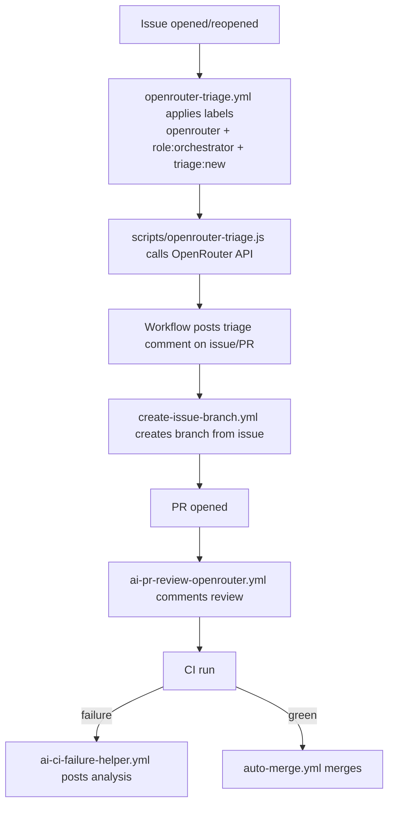

## Issue Automation Flow

## Requirements (RFC 2119)

- **R-IAF-01:** New issues **MUST** receive routing labels and OpenRouter triage comments.
- **R-IAF-02:** The flow **MUST NOT** depend on paid GitHub Copilot services.
- **R-IAF-03:** The label `no-triage` **MAY** be used to skip OpenRouter triage.
- **R-IAF-04:** Existing branch creation, PR review, CI failure helper, and auto-merge workflows **MUST** stay in the chain.

## End-to-end flow

## Copilot policy statement

No paid GitHub Copilot service is required anywhere in this flow. Automation routing is done by direct OpenRouter API calls using `OPENROUTER_API_KEY`.

## Deprecated / superseded (listed only)

The following workflows are candidates for future cleanup and are not removed in this PR:

- `jules-*.yml`
- `panda-ops.yml`
- `recurse-ml.yml`
