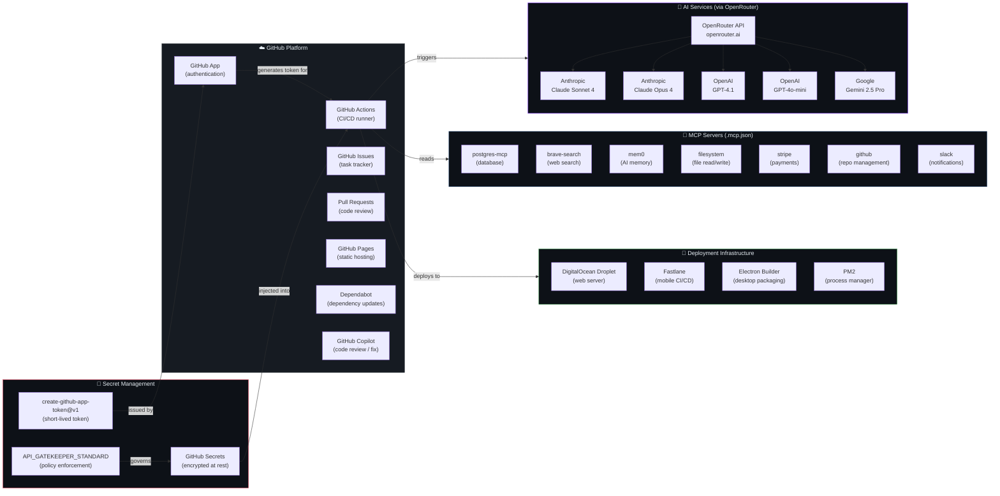
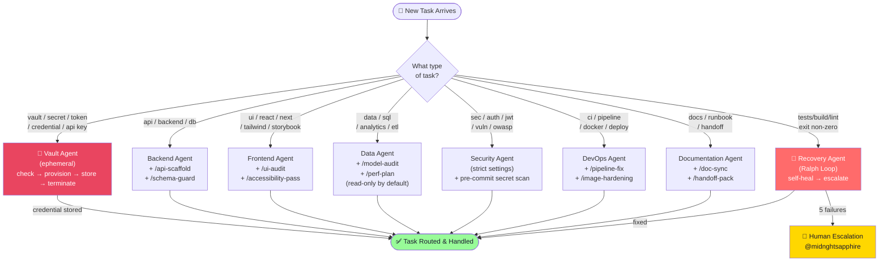
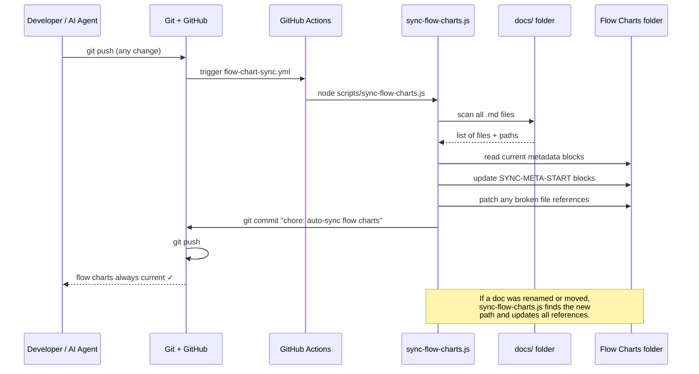

# Master Revvel-Standards Flow — 3D Layered Chart

**Version:** 1.0.0
**Date:** April 15, 2026
**Status:** Auto-Maintained
**Maintained by:** `scripts/sync-flow-charts.js`

> **How to view:** This document uses [Mermaid](https://mermaid.js.org/) diagrams.
> They render automatically in GitHub, VS Code (with Mermaid extension), Notion, and Obsidian.
> For a standalone HTML render, open [mermaid.live](https://mermaid.live) and paste the code block.

---

## Diagram 1 — Master Process Flow (Top-Down Layers)

Each horizontal band is a "layer" of the workflow. Subgraphs give the 3D depth effect.

```mermaid
flowchart TD
    %% ─── LAYER 0: FOUNDATION ─────────────────────────────────────────
    subgraph L0["🏛️  LAYER 0 — FOUNDATION (Read the Rules)"]
        direction LR
        SSOT["📖 REVVEL_MASTER_STANDARDS.md\n(Single Source of Truth)"]
        STANDARDS_INDEX["§0 Standards Index"]
        EXRUP["§1 EXRUP / XRP Methodology"]
        DEPLOY_STD["§5 Deployment Standards"]
        AUTODOC["§7 Auto-Documentation Rules"]
        SSOT --> STANDARDS_INDEX
        SSOT --> EXRUP
        SSOT --> DEPLOY_STD
        SSOT --> AUTODOC
    end

    %% ─── LAYER 1: RESEARCH ───────────────────────────────────────────
    subgraph L1["🔬  LAYER 1 — DEEP RESEARCH (5 AI Agents)"]
        direction LR
        RESEARCH_WF["⚙️ research-module.yml\n(GitHub Actions)"]
        OR["🌐 OpenRouter API"]
        subgraph AGENTS["Parallel Sub-Agents"]
            A1["Agent 1: SPEC\nClaude Sonnet 4"]
            A2["Agent 2: COMPETITIVE\nGPT-4.1"]
            A3["Agent 3: SECURITY\nClaude Opus 4"]
            A4["Agent 4: COST\nGPT-4o-mini"]
            A5["Agent 5: COMMUNITY\nGemini 2.5 Pro"]
        end
        SYNTH["🧠 Synthesizer\nClaude Opus 4"]
        RESEARCH_DOC["📄 Research .md\n(committed to docs/)"]
        RESEARCH_WF --> OR
        OR --> A1 & A2 & A3 & A4 & A5
        A1 & A2 & A3 & A4 & A5 --> SYNTH
        SYNTH --> RESEARCH_DOC
    end

    %% ─── LAYER 2: DOCUMENTATION ──────────────────────────────────────
    subgraph L2["📝  LAYER 2 — CREATE DOCUMENTATION"]
        direction LR
        BOOTSTRAP["🛠️ bootstrap-new-project.sh"]
        TEMPLATES["📁 templates/ folder"]
        subgraph MANDATORY_DOCS["Mandatory Artifacts"]
            D1["README.md"]
            D2["BLUEPRINT.md"]
            D3["ROADMAP.md"]
            D4["KANBAN_CARDS.md"]
            D5["CHANGELOG.md"]
            D6["INFRASTRUCTURE_MAP.md"]
        end
        BOOTSTRAP --> TEMPLATES
        TEMPLATES --> D1 & D2 & D3 & D4 & D5 & D6
    end

    %% ─── LAYER 3: ISSUE & BRANCH ─────────────────────────────────────
    subgraph L3["🎫  LAYER 3 — ISSUE & BRANCH CREATION"]
        direction LR
        GH_CLI["💻 gh issue create\n(GitHub CLI)"]
        AUTO_ISSUE["🤖 research-module.yml\nauto-creates issue"]
        GITHUB_ISSUE["📌 GitHub Issue\n(labeled + assigned)"]
        ISSUE_BRANCH_WF["⚙️ issue-branch.yml\n(GitHub App)"]
        NEW_BRANCH["🌿 New Branch\nissue-{n}-{slug}"]
        GH_CLI --> GITHUB_ISSUE
        AUTO_ISSUE --> GITHUB_ISSUE
        GITHUB_ISSUE --> ISSUE_BRANCH_WF
        ISSUE_BRANCH_WF --> NEW_BRANCH
    end

    %% ─── LAYER 4: BUILD & CI ─────────────────────────────────────────
    subgraph L4["💻  LAYER 4 — BUILD, COMMIT & CI"]
        direction LR
        GIT_PUSH["git push\n(developer / AI agent)"]
        subgraph CI_CHECKS["GitHub Actions CI"]
            CI["ci.yml\nlint + test + type-check"]
            SEC["security.yml\nsecret scan + CodeQL"]
            SYNTAX["syntax-check.yml\nYAML / JSON / TS"]
            COMPLIANCE["check-compliance.js\nREVVEL compliance"]
        end
        PR["📬 Pull Request opened"]
        GIT_PUSH --> CI_CHECKS
        GIT_PUSH --> PR
    end

    %% ─── LAYER 5: SELF-HEALING ───────────────────────────────────────
    subgraph L5["🔁  LAYER 5 — RALPH LOOP (Self-Healing CI)"]
        direction LR
        RALPH["⚙️ ralph-loop.yml\nfires on CI failure"]
        COPILOT_FIX["🤖 @Copilot\nreads error, pushes fix"]
        RETRY{"Retry\n≤ 5 times?"}
        ESCALATE["🚨 Escalate to\n@midnghtsapphire\n(needs-human label)"]
        UNBLOCK["✅ CI passes\nwon't-merge label removed"]
        RALPH --> COPILOT_FIX
        COPILOT_FIX --> RETRY
        RETRY -->|"Yes (attempt < 5)"| RALPH
        RETRY -->|"No (attempt = 5)"| ESCALATE
        RALPH -->|"CI now passes"| UNBLOCK
    end

    %% ─── LAYER 6: REVIEW ─────────────────────────────────────────────
    subgraph L6["👁️  LAYER 6 — CODE REVIEW"]
        direction LR
        READY_WF["⚙️ ready-for-review.yml"]
        COPILOT_REVIEW["🤖 GitHub Copilot\nauto-review"]
        CLAUDE_REVIEW["🤖 Claude Code\n(if configured)"]
        HUMAN_REVIEW["👤 Human Review\n(@midnghtsapphire)"]
        APPROVED["✅ PR Approved"]
        READY_WF --> COPILOT_REVIEW & CLAUDE_REVIEW & HUMAN_REVIEW
        COPILOT_REVIEW & CLAUDE_REVIEW & HUMAN_REVIEW --> APPROVED
    end

    %% ─── LAYER 7: DEPLOY ─────────────────────────────────────────────
    subgraph L7["🚀  LAYER 7 — MERGE & DEPLOY"]
        direction LR
        MERGE["Merge to main"]
        CHANGELOG_UPDATE["📋 CHANGELOG.md\nauto-updated\n(panda-ops.yml)"]
        subgraph DEPLOY_TARGETS["Deploy Targets"]
            WEB["🌐 Web\ndeploy.yml → DigitalOcean\nSSH + pm2"]
            IOS["🍎 iOS\ndeploy-ios.yml\nFastlane → App Store"]
            ANDROID["🤖 Android\ndeploy-android.yml\nFastlane → Play Store"]
            PAGES["📄 GitHub Pages\nStatic site deploy"]
        end
        MERGE --> CHANGELOG_UPDATE
        MERGE --> WEB & IOS & ANDROID & PAGES
    end

    %% ─── LAYER 8: AUTO-SYNC ──────────────────────────────────────────
    subgraph L8["🔄  LAYER 8 — FLOW CHART AUTO-SYNC"]
        direction LR
        SYNC_WF["⚙️ flow-chart-sync.yml\nfires on every push"]
        SYNC_SCRIPT["🔧 scripts/sync-flow-charts.js"]
        SCAN["📂 Scans all docs/\nfor .md files"]
        UPDATE_META["✏️ Updates metadata\nblocks in flow charts"]
        PATCH_REFS["🔗 Patches broken\nfile references"]
        COMMIT_SYNC["💾 Commits & pushes\nupdated docs"]
        SYNC_WF --> SYNC_SCRIPT
        SYNC_SCRIPT --> SCAN --> UPDATE_META --> PATCH_REFS --> COMMIT_SYNC
    end

    %% ─── VERTICAL CONNECTORS (layer-to-layer) ────────────────────────
    L0 -->|"Standards understood"| L1
    L1 -->|"Research complete"| L2
    L2 -->|"Docs created"| L3
    L3 -->|"Branch ready"| L4
    L4 -->|"CI fails"| L5
    L4 -->|"CI passes"| L6
    L5 -->|"Fixed or escalated"| L6
    L6 -->|"Approved"| L7
    L7 -->|"Deployed"| L8
    L8 -->|"🔄 next iteration"| L0

    %% ─── STYLES ──────────────────────────────────────────────────────
    style L0 fill:#1a1a2e,color:#e0e0e0,stroke:#7b2fff
    style L1 fill:#16213e,color:#e0e0e0,stroke:#0f3460
    style L2 fill:#0f3460,color:#e0e0e0,stroke:#533483
    style L3 fill:#533483,color:#e0e0e0,stroke:#e94560
    style L4 fill:#e94560,color:#fff,stroke:#ff6b6b
    style L5 fill:#ff6b6b,color:#fff,stroke:#ffa07a
    style L6 fill:#ffa07a,color:#1a1a2e,stroke:#ffd700
    style L7 fill:#ffd700,color:#1a1a2e,stroke:#98fb98
    style L8 fill:#98fb98,color:#1a1a2e,stroke:#1a1a2e
    style AGENTS fill:#0d1b2a,color:#e0e0e0,stroke:#7b2fff
    style MANDATORY_DOCS fill:#0d1b2a,color:#e0e0e0,stroke:#7b2fff
    style CI_CHECKS fill:#0d1b2a,color:#e0e0e0,stroke:#ff6b6b
    style DEPLOY_TARGETS fill:#0d1b2a,color:#1a1a2e,stroke:#ffd700
```

---

## Diagram 2 — API & Tool Connectivity Map

---

## Diagram 3 — Gatekeeper / Agent Decision Tree

---

## Diagram 4 — Documentation Auto-Sync Loop

---

*Auto-maintained. Last sync: 2026-04-15. Script: `scripts/sync-flow-charts.js`*
