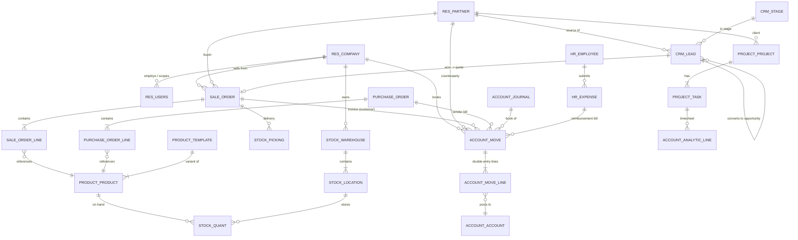

# Odoo Integration Standard — Multi-Business ERP, CRM & Free Accounting

**Version:** 1.0.0
**Date:** April 20, 2026
**Status:** Mandatory Policy — SINGLE SOURCE OF TRUTH
**Author:** Audrey Evans (MIDNGHTSAPPHIRE)
**Applies To:** Every MIDNGHTSAPPHIRE business entity (Vine House, Vine House Capital, Revvel tech ecosystem, e-commerce storefronts, and `reese-reviews`) that needs ERP, CRM, or accounting capabilities

---

## 1. Why Odoo, and Why One Shared Instance

MIDNGHTSAPPHIRE runs **multiple legal entities and product lines** (Vine House products, Vine House Capital rentals, the Revvel tech ecosystem, specialty e-commerce, and `reese-reviews`). Each of them individually needs:

- A **CRM** (leads, opportunities, contacts, pipelines) — already standardised in [`LEADS_STANDARD.md`](LEADS_STANDARD.md).
- An **ERP** — products, inventory, purchase orders, sales orders, manufacturing, projects.
- **Accounting** — journals, invoices, bank reconciliation, tax reports.
- **HR / payroll / expenses** as headcount grows.

Buying one SaaS subscription per entity (QuickBooks + HubSpot + Shopify admin + Rentec + …) is the highest-cost, lowest-interop path. **Odoo Community Edition (CE)** is the only FOSS platform that covers all of these from one database, supports true multi-company out of the box, and has an officially-maintained accounting module that is free.

### 1.1 Decision

| Decision | Value |
|---|---|
| **Platform** | Odoo Community Edition (CE), latest LTS (18.0 at the time of writing) |
| **Licence** | LGPL-3.0 (FOSS, no per-user fees) |
| **Deployment** | Self-hosted on the existing Revvel DigitalOcean droplet ecosystem (PM2-sibling container), behind Nginx |
| **Database** | Managed PostgreSQL (shared Revvel instance) — see [`DATABASE_ARCHITECTURE_STANDARD.md`](DATABASE_ARCHITECTURE_STANDARD.md) |
| **Multi-business model** | One Odoo database, **multiple companies** (multi-company feature), one chart of accounts per legal entity |
| **Accounting module** | Odoo `account` (CE) — invoicing, bills, bank reconciliation, journals, tax reports. Zero licence cost. |
| **CRM module** | Odoo `crm` (CE) — pipelines align 1:1 with [`LEADS_STANDARD.md`](LEADS_STANDARD.md) stages |
| **ERP modules** | `sale`, `purchase`, `stock`, `mrp`, `project`, `hr`, `hr_expense` (all CE) |

> **Why not Odoo.sh / Enterprise?** Enterprise adds closed modules (e.g. advanced accounting reports, studio, marketing automation) that we do **not** need — Revvel already has marketing automation and BI standards. CE + a small number of OCA modules covers 100 % of our requirements at $0 licence cost.

### 1.2 Prior Art in the Ecosystem

This was flagged in the issue as "possibly already integrated in reese-reviews". A repo-wide search (`grep -i odoo`) confirmed **no existing Odoo code or configuration** in `revvel-standards`, and no standard document for it. This standard is therefore the first authoritative specification. If `reese-reviews` (a sibling MIDNGHTSAPPHIRE repo) already has Odoo glue code, Phase 1 of the rollout (§7) explicitly requires it to be audited against this standard and, if present, folded in as the reference implementation.

---

## 2. Multi-Company Architecture

Odoo has **first-class multi-company support** — one database can host many companies, each with its own:

- Chart of accounts and fiscal year
- Currencies and taxes
- Sales/purchase journals
- Users with per-company access rights
- Branding on invoices and portals

We map **one Odoo company per MIDNGHTSAPPHIRE legal entity or brand**:

| Odoo Company Code | Legal Entity / Brand | Purpose |
|---|---|---|
| `MIDNGHTSAPPHIRE` | MIDNGHTSAPPHIRE (parent) | Consolidation, inter-company services |
| `VINE_HOUSE` | Vine House (products LLC) | Product manufacturing, sales, inventory |
| `VINE_HOUSE_CAPITAL` | Vine House Capital (rental LLC) | Property ledger, tenant invoicing, rent receipts |
| `REVVEL_TECH` | Revvel Tech operating entity | SaaS revenue, OpenAI/AWS/DO expenses for all Revvel apps |
| `REESE_REVIEWS` | reese-reviews (brand) | Review-business revenue and expenses |
| `FREEDOM_ANGEL_CORPS` | Enterprise org (see [`REPOSITORY_PRIVACY_MIGRATION_STANDARD.md`](REPOSITORY_PRIVACY_MIGRATION_STANDARD.md)) | Future consolidated entity |

Inter-company rules (`purchase_sale` chain) are enabled so a sale from `VINE_HOUSE` to `REVVEL_TECH` (e.g. internal product use) automatically creates the mirrored bill on the other side. This gives us auditable, GAAP-clean inter-entity books with no manual duplication.

Full hierarchy rationale is maintained in [`ENTITY_HIERARCHY.md`](ENTITY_HIERARCHY.md). Any change to companies in Odoo **must** be reflected there in the same PR.

---

## 3. Module Matrix — What We Turn On, What We Don't

| Module | Role | Status | Replaces / Supersedes |
|---|---|---|---|
| `base`, `mail`, `web` | Core | ✅ Always on | — |
| `contacts` | Unified contact book across companies | ✅ Always on | Airtable / Notion contact sheets |
| `crm` | Sales pipelines, leads, opportunities | ✅ Always on | Manual spreadsheets; aligns with [`LEADS_STANDARD.md`](LEADS_STANDARD.md) |
| `sale`, `sale_management` | Quotes → sales orders → invoices | ✅ Always on | Custom invoicing scripts |
| `purchase` | Vendor bills, POs | ✅ Always on | Manual invoice tracking |
| `account` (CE accounting) | Journals, bank statements, tax reports | ✅ Always on — **free model** | QuickBooks, FreshBooks (both deferred) |
| `stock` | Warehouses, inventory, lots/serials | ✅ Always on for Vine House | inFlow, Airtable inventory |
| `mrp` | Manufacturing (coffee blends, specialty items) | 🔵 Configure when Vine House production starts | — |
| `project` | Tasks, timesheets, project profitability | ✅ Always on | GitHub Projects for non-code work |
| `hr`, `hr_expense` | Employees, expense reimbursement | 🟡 Enable on first hire | — |
| `hr_payroll` | Payroll runs | ❌ CE version is limited — use Gusto / Wave Payroll instead | |
| `website`, `website_sale` | Public storefront | ❌ **Do not use** — our storefronts are Shopify / custom Next.js per [`_MASTER_INVENTORY.md`](../_MASTER_INVENTORY.md §4). Odoo stays headless. | |
| `point_of_sale` | Retail POS | 🟡 Evaluate only if in-person Vine House events happen | |
| `marketing_automation` | Drip campaigns | ❌ **Do not use** — Enterprise-only; use Loops / Mailchimp per [`MARKETING_AUTOMATION_STANDARD.md`](MARKETING_AUTOMATION_STANDARD.md) | |
| OCA `account_financial_report` | Replaces Enterprise advanced reports | ✅ Install from OCA | Odoo Enterprise financial reports |
| OCA `mis_builder` | Custom KPIs / dashboards | 🟡 Evaluate in Phase 3 | Metabase for some views |

Principle: **Odoo is our back-office system of record**. Public-facing customer experience stays on the existing Next.js / Shopify storefronts; those systems push data into Odoo via the integration layer in §5 rather than being replaced.

---

## 4. Data Model — ERD

The following is the **simplified ERD** of the entities we actively read/write across Revvel apps. All tables are native Odoo models (prefix `res.`, `crm.`, `sale.`, `account.`, `stock.`, `project.`). Field names are the real Odoo model fields so this ERD is executable guidance, not illustrative.



### 4.1 Entity Cheat Sheet

| Odoo Model | What it stores | Who writes to it |
|---|---|---|
| `res.company` | Legal entity / brand | Admin only, one-time per entity |
| `res.users` | System users (internal + portal) | Admin; SCIM from SSO when that lands |
| `res.partner` | Contacts, customers, vendors, tenants | CRM, leads sync, Shopify webhook |
| `crm.lead` | Lead / opportunity | Marketing site forms, Revvel app signup webhook |
| `crm.stage` | Pipeline stages | Matches [`LEADS_STANDARD.md`](LEADS_STANDARD.md) stage codes exactly |
| `product.template` / `product.product` | SKUs (products, services, subscriptions) | Vine House catalog, Revvel SaaS plans |
| `sale.order` | Quote → confirmed sale | CRM conversion, Shopify webhook, Stripe checkout |
| `account.move` | Any accounting document (invoice, bill, journal entry) | `sale`, `purchase`, bank imports |
| `account.move.line` | Individual debit/credit line | Always via `account.move`, never directly |
| `account.journal` | Sales / purchase / bank / cash journals | Admin setup per company |
| `account.account` | Chart of accounts | Localised per company (US CoA + IRS mappings) |
| `stock.picking` | Delivery / receipt order | `sale` and `purchase` |
| `stock.quant` | On-hand quantities | Computed from pickings |
| `project.project`, `project.task` | Internal work tracking | Revvel engineers, GrowlingEyes operations |
| `account.analytic.line` | Timesheet / cost entry | `project` + `hr_expense` |
| `hr.employee` | Staff records | HR admin |

### 4.2 Cross-System Identifiers

Every record that has a counterpart outside Odoo **must** carry an external reference:

- `x_external_system` (selection: `shopify`, `stripe`, `revvel_app`, `reese_reviews`, `manual`)
- `x_external_id` (char, indexed) — the ID in that source system
- Combined unique constraint: `(x_external_system, x_external_id, company_id)`

These custom fields are added via a thin OCA-style module `revvel_odoo_bridge` (see §5.4). They are the only supported way to dedupe webhook imports.

---

## 5. Integration Plan — How Odoo Plugs Into the Revvel Stack

### 5.1 Reference Topology

```text
              ┌──────────────────────── MIDNGHTSAPPHIRE ────────────────────────┐
              │                                                                 │
 Shopify ─┐   │   ┌─────────────┐   Nginx   ┌────────────────────┐   pg       │
 Stripe  ─┼──►│──►│  Bridge API │──────────►│ Odoo CE (Docker)   │──────►┐    │
 Revvel   │   │   │ (FastAPI /  │  XML-RPC  │   workers + cron   │       │    │
  apps   ─┘   │   │  Node)      │  JSON-RPC │                    │       ▼    │
              │   └─────────────┘           └────────────────────┘   DO Managed│
              │         ▲                          ▲                Postgres  │
              │         │ webhooks                 │ scheduled sync            │
              │  reese-reviews, GrowlingEyes,  bank feeds (OFX / CSV)          │
              │  Penny Scout, Soul2Bowl, ...                                    │
              └─────────────────────────────────────────────────────────────────┘
```

### 5.2 Integration Contract

All external systems talk to Odoo **through a single bridge service**, never by hitting `xmlrpc/2/object` directly. The bridge:

1. Authenticates callers against Revvel Vault (see [`VAULT_AGENT_STANDARD.md`](VAULT_AGENT_STANDARD.md)) and Revvel API Gatekeeper rules (see [`API_GATEKEEPER_STANDARD.md`](API_GATEKEEPER_STANDARD.md)).
2. Validates the payload against a JSON schema (one schema per event type).
3. Maps the payload to Odoo models using the `x_external_system` / `x_external_id` pair.
4. Calls Odoo via XML-RPC (`execute_kw`) or JSON-RPC. Uses `create_or_update` semantics — upsert on the external key.
5. Writes an audit row to the Revvel audit log (see [`SECURITY_STANDARD.md`](SECURITY_STANDARD.md)).

### 5.3 Webhook Sources (Phase 1 scope)

| Source | Odoo action | Model(s) touched |
|---|---|---|
| Shopify `orders/create` | Upsert partner, upsert sale order, confirm, create delivery | `res.partner`, `sale.order`, `stock.picking` |
| Shopify `refunds/create` | Credit note on matching invoice | `account.move` |
| Stripe `invoice.paid` | Register payment on customer invoice | `account.payment`, `account.move` |
| Stripe `charge.refunded` | Refund payment + reconcile | `account.payment` |
| Revvel Lead form (`LEADS_STANDARD.md`) | Upsert `crm.lead` in the lead's company scope | `crm.lead`, `res.partner` |
| `reese-reviews` completed review | Create project task + timesheet entry + optional vendor bill | `project.task`, `account.move` |
| GrowlingEyes subscription event | Upsert subscription product + sale order | `product.product`, `sale.order` |
| Vine House Capital rent paid | Create customer invoice + payment reconciliation | `account.move`, `account.payment` |

### 5.4 `revvel_odoo_bridge` Custom Module

One thin Odoo addon, kept in this repo's `templates/odoo/` tree (added in a subsequent PR — see §7 rollout), owns:

- `x_external_system`, `x_external_id` fields on the models in §4.2.
- A `revvel.bridge.event` model to log every inbound event (idempotency check + retry tracking).
- Server actions that convert incoming payloads into Odoo records using the mapping rules in this document.

This module is the **only** place in Odoo where Revvel-specific logic lives. No core model is monkey-patched; we only extend via `_inherit`.

### 5.5 Outbound Sync

Odoo is the source of truth for **accounting, inventory on hand, and company-level contact records**. When those change, Odoo emits events through an outgoing webhook queue:

| Odoo trigger | Event | Consumers |
|---|---|---|
| `account.move` posted (invoice/bill) | `accounting.invoice.posted` | Revvel BI warehouse, customer portal notifier |
| `stock.quant` change on a tracked SKU | `inventory.level.changed` | Shopify (stock sync), Vine House admin dashboard |
| `res.partner` create/update | `contact.upserted` | CRM mirror caches, marketing automation |

Outbound events go through the same bridge, signed with HMAC-SHA256 (secret from Vault), and are consumed by each target per its own runbook.

---

## 6. Free Accounting Model — Concretely

The word "free" in the issue title refers to two distinct things — both are satisfied:

1. **Zero software-licence cost** — Odoo CE `account` module is LGPL-3.0. We pay nothing per-user, per-company, or per-invoice.
2. **Zero transaction fee added by Odoo** — unlike QuickBooks Online ACH or Wave payroll, Odoo itself does not charge per invoice. Stripe / bank fees remain identical to today.

### 6.1 Chart of Accounts

Each company gets a US chart of accounts loaded from Odoo's `l10n_us` module, then extended with Revvel-specific accounts:

- `4100` Revenue — SaaS subscriptions (Revvel Tech company only)
- `4200` Revenue — Product sales (Vine House only)
- `4300` Revenue — Rental income (Vine House Capital only)
- `4400` Revenue — Review services (reese-reviews only)
- `5200` COGS — Cloud infrastructure (DigitalOcean, managed Postgres)
- `5300` COGS — AI / LLM spend (OpenAI, Anthropic, OpenRouter) — tracked here so per-model unit economics are visible
- `6xxx` OpEx per [`_MASTER_INVENTORY.md`](../_MASTER_INVENTORY.md) categories

### 6.2 Tax & Compliance

- US sales tax via Odoo `l10n_us` + per-state fiscal positions.
- 1099-NEC tracking: vendors exceeding the IRS $600 threshold are tagged on `res.partner` (`l10n_us_check_1099`) so the year-end 1099 export is one click.
- Aligns with the $600 threshold rules already codified in [`AFFILIATE_MARKETING_STANDARD.md`](AFFILIATE_MARKETING_STANDARD.md).

### 6.3 What We Still Pay For

| Capability | Why Odoo CE doesn't fully cover it | Supplement |
|---|---|---|
| Payroll tax filing | CE `hr_payroll` is generic | Gusto ($40/mo + $6/employee) when we hire W-2 |
| US bank auto-feed | CE requires manual OFX/CSV import | Optional Plaid bridge ($0 dev, metered prod) |
| Advanced financial reports | Some reports are Enterprise-only | OCA `account_financial_report` (free) |

Everything else — invoicing, bill entry, bank reconciliation, tax reports, inter-company — runs on CE at $0 licence cost.

---

## 7. Rollout Plan

### Phase 0 — Decision & Audit (week 1)
- [ ] Land this standard (this PR).
- [ ] Audit `reese-reviews` for any pre-existing Odoo glue code. If found, extract it into `revvel_odoo_bridge` and document divergences from this standard.
- [ ] Add Odoo rows to [`_MASTER_INVENTORY.md`](../_MASTER_INVENTORY.md) and [`_MASTER_BOM.md`](../_MASTER_BOM.md) (done in this PR).

### Phase 1 — Minimum Viable Back Office (weeks 2–3)
- [ ] Stand up Odoo 18 CE via Docker Compose on the shared DO droplet, behind Nginx with TLS.
- [ ] Point Odoo at the managed Postgres cluster (its own DB, same pg server).
- [ ] Create the four Phase-1 companies: `MIDNGHTSAPPHIRE`, `VINE_HOUSE`, `VINE_HOUSE_CAPITAL`, `REVVEL_TECH`.
- [ ] Install modules listed as "✅ Always on" in §3.
- [ ] Load US CoA via `l10n_us`; extend per §6.1.
- [ ] Ship `revvel_odoo_bridge` v0.1 with the external-ID fields + inbound webhook handler for Shopify and Stripe.

### Phase 2 — CRM & Leads Unification (weeks 4–5)
- [ ] Map `crm.stage` records to the stage codes in [`LEADS_STANDARD.md`](LEADS_STANDARD.md).
- [ ] Migrate existing lead data (currently spreadsheets) via `base_import` CSV.
- [ ] Wire Revvel product landing pages to post leads into Odoo through the bridge.

### Phase 3 — reese-reviews & Remaining Brands (weeks 6–7)
- [ ] Add `REESE_REVIEWS` and any remaining companies.
- [ ] Migrate reese-reviews invoices + contacts.
- [ ] Enable outbound events (§5.5).
- [ ] Dashboards: install `mis_builder`, build a consolidated P&L across all companies.

### Phase 4 — Steady State (week 8 onward)
- [ ] Dependabot-equivalent process for Odoo + OCA modules (pinned versions, monthly upgrade window).
- [ ] Nightly full backup (pg dump + Odoo filestore tarball) to DO Spaces, 30-day retention.
- [ ] Add Odoo to uptime monitoring and Sentry error forwarding per [`SECURITY_STANDARD.md`](SECURITY_STANDARD.md).

---

## 8. Security, Privacy & Compliance

1. **Secrets** — DB password, admin password, bridge HMAC key live in Vault. No secret may appear in `odoo.conf`, git, or `.env.example`. Enforced by the pre-commit secret-scanning hooks (`detect-secrets` and `detect-private-key`) defined by [`SYNTAX_ERROR_PREVENTION_STANDARD.md`](SYNTAX_ERROR_PREVENTION_STANDARD.md).
2. **Access** — Portal users (customers, tenants) get read-only access to their own records through Odoo's built-in portal. Internal users authenticate via Google OAuth (and SAML later per [`SSO_SAML_STANDARD.md`](SSO_SAML_STANDARD.md)).
3. **Repo hosting** — `revvel_odoo_bridge` source lives in a **private** Freedom Angel Corps repo per [`REPOSITORY_PRIVACY_MIGRATION_STANDARD.md`](REPOSITORY_PRIVACY_MIGRATION_STANDARD.md). PII test fixtures are never committed.
4. **Backups** — Encrypted at rest (DO Spaces SSE). Restore drill quarterly, logged in [`DARE_LOG.md`](DARE_LOG.md).
5. **Data retention** — Follows the retention matrix in [`SECURITY_STANDARD.md`](SECURITY_STANDARD.md). Soft-delete is disabled in Odoo; we rely on archival (`active = False`) + fiscal-year lockdown in accounting.
6. **Audit log** — `mail.thread`/`mail.activity` + the bridge audit table give us full write traceability, consumable by the Audit Agent ([`AUTOMATED_AUDIT_AGENT_STANDARD.md`](AUTOMATED_AUDIT_AGENT_STANDARD.md)).

---

## 9. Compliance Checks

These are the Odoo-specific checks added to the compliance rubric ([`COMPLIANCE_RUBRIC.md`](COMPLIANCE_RUBRIC.md)). Category: **I — Back-Office Integration**.

| ID | Check | Priority |
|---|---|---|
| I1 | `ODOO_INTEGRATION_STANDARD.md` is referenced from any project that posts invoices, sales orders, leads, or inventory to an external system | P1 |
| I2 | Any new webhook/consumer that writes accounting or inventory data routes through the bridge service (no direct XML-RPC from app code) | P0 |
| I3 | Every Odoo record mirrored from an external system has `x_external_system` + `x_external_id` populated | P1 |
| I4 | Odoo backups (DB + filestore) run nightly and are stored encrypted in DO Spaces | P0 |
| I5 | Secrets for Odoo are stored in Vault, not in repository config | P0 |
| I6 | New Odoo companies added to the instance are also reflected in [`ENTITY_HIERARCHY.md`](ENTITY_HIERARCHY.md) | P2 |

---

## 10. FAQ

**Q: Can't we just use Wave + HubSpot free tiers per entity?**
Wave has no multi-company consolidation; HubSpot free CRM caps pipelines and blocks API access we need. Running five disjoint free tools costs more in integration work than self-hosting one Odoo.

**Q: What's the minimum infra cost?**
≈$0 incremental — Odoo runs on the shared $12–24/mo droplet and the existing $15/mo managed Postgres. Backups ride on DO Spaces (already P0 per some project BOMs).

**Q: What about upgrades between Odoo LTS versions?**
OCA publishes `openupgrade` scripts for each LTS→LTS jump. We upgrade once per LTS, in a staging environment first per [`TEST_ENVIRONMENTS_STANDARD.md`](TEST_ENVIRONMENTS_STANDARD.md).

**Q: If `reese-reviews` already has Odoo code, do we throw this away?**
No. That code is the reference implementation we pull forward. This standard tells us **what** must be true; the reese-reviews code tells us **how much** is already in place. Phase 0 explicitly audits it.

---

## 11. Related Standards

| Standard | Relationship |
|---|---|
| [`LEADS_STANDARD.md`](LEADS_STANDARD.md) | CRM stage codes in Odoo must equal the codes here |
| [`DATABASE_ARCHITECTURE_STANDARD.md`](DATABASE_ARCHITECTURE_STANDARD.md) | Odoo DB lives on the shared managed Postgres |
| [`API_GATEKEEPER_STANDARD.md`](API_GATEKEEPER_STANDARD.md) | Bridge traffic must pass API Gatekeeper rules |
| [`VAULT_AGENT_STANDARD.md`](VAULT_AGENT_STANDARD.md) | All Odoo and bridge secrets via Vault |
| [`SECURITY_STANDARD.md`](SECURITY_STANDARD.md) | Backups, retention, audit |
| [`MARKETING_AUTOMATION_STANDARD.md`](MARKETING_AUTOMATION_STANDARD.md) | Marketing automation stays out of Odoo |
| [`AFFILIATE_MARKETING_STANDARD.md`](AFFILIATE_MARKETING_STANDARD.md) | IRS $600 threshold tagging on `res.partner` |
| [`ENTITY_HIERARCHY.md`](ENTITY_HIERARCHY.md) | Source of truth for the company list |
| [`REPOSITORY_PRIVACY_MIGRATION_STANDARD.md`](REPOSITORY_PRIVACY_MIGRATION_STANDARD.md) | Bridge addon repo privacy |
| [`TEST_ENVIRONMENTS_STANDARD.md`](TEST_ENVIRONMENTS_STANDARD.md) | Staging → live-test → prod pipeline for Odoo upgrades |
| [`COMPLIANCE_RUBRIC.md`](COMPLIANCE_RUBRIC.md) | Category I checks listed in §9 |

---

*Maintained by the Revvel coding agent. This document is the authoritative specification for all Odoo-related work across MIDNGHTSAPPHIRE businesses. Changes require a PR that updates this file **and** the related standards above in the same commit.*
