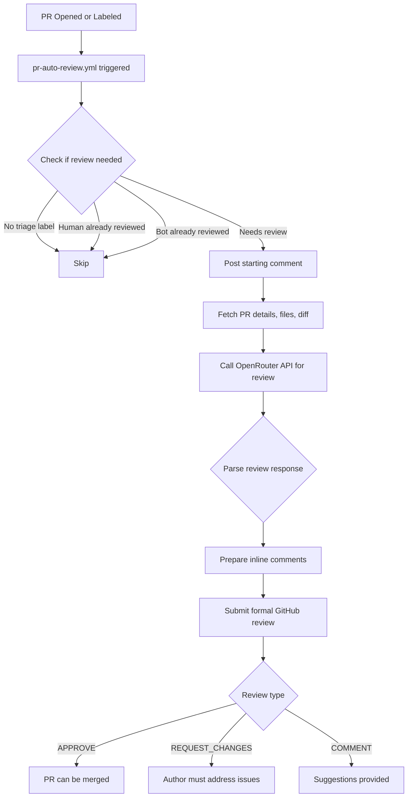

# PR Auto Review Automation

Automated code review submission system that uses OpenRouter to review pull requests and submit formal GitHub reviews with inline comments.

---

## Overview

The PR Auto Review Automation system automatically performs code reviews on pull requests that need review. When a PR has the "awaiting-approval" label or is newly opened, the system uses OpenRouter AI to analyze the code changes and submit a formal GitHub review — complete with inline comments and an overall assessment.

### Key Features

1. **Automatic Trigger** — Activates when PR needs review (has "awaiting-approval" label or newly opened)
2. **Comprehensive Analysis** — Analyzes PR diff, files changed, and PR description
3. **OpenRouter-Powered** — Uses AI (via OpenRouter API) to generate code review feedback
4. **Formal Review Submission** — Actually submits a GitHub review (not just comments)
5. **Inline Comments** — Can post comments on specific lines of code
6. **Smart Assessment** — Provides APPROVE, REQUEST_CHANGES, or COMMENT reviews based on findings
7. **Non-Intrusive** — Skips review if human reviewers have already acted

---

## How It Works

### Workflow Sequence



### Review Types

The system can submit three types of reviews:

| Review Type | When Used | Effect |
|------------|-----------|--------|
| `APPROVE` | No critical issues found; code looks good | PR can be merged (with required approval count met) |
| `REQUEST_CHANGES` | Critical bugs, security issues, or blocking problems | PR cannot be merged until addressed |
| `COMMENT` | Suggestions or observations without blocking issues | PR can still be merged; feedback is advisory |

---

## Labels

### Trigger Label

| Label | Color | Meaning | Applied By |
|-------|-------|---------|------------|
| `awaiting-approval` |  Yellow | PR needs review | pr-review-status.yml |

### Skip Labels

| Label | Meaning | Effect |
|-------|---------|--------|
| `no-triage` | Skip all automation | Workflow will not run |

---

## Example Workflow

### 1. PR Needs Review

Alice opens a new PR. The `pr-review-status.yml` workflow applies the `awaiting-approval` label.

### 2. System Activates

- `pr-auto-review.yml` detects the label
- Checks that no human review exists yet
- Posts initial status comment:

```markdown
🤖 **Automated Code Review Starting**

OpenRouter is analyzing this PR and will submit a review shortly...

Model: `anthropic/claude-sonnet-4`

_This is an automated review via OpenRouter._
```

### 3. OpenRouter Analyzes

The script fetches:
- PR details (title, description, author)
- Files changed (list with additions/deletions)
- Full diff of all changes

It sends this to OpenRouter with instructions to:
- Check for bugs, security issues, logic errors
- Review code quality and best practices
- Provide specific, actionable feedback
- Return a structured JSON response

### 4. Review Submitted

OpenRouter returns a structured review:

```json
{
  "overall_assessment": "COMMENT",
  "summary": "Code looks generally good with a few suggestions",
  "inline_comments": [
    {
      "file": "src/utils.js",
      "line": 42,
      "comment": "Consider adding error handling for this network request"
    },
    {
      "file": "README.md",
      "line": 15,
      "comment": "Update the documentation to reflect the new API endpoint"
    }
  ],
  "general_feedback": [
    "Tests look comprehensive",
    "Good use of TypeScript types"
  ]
}
```

The system submits a formal GitHub review with:
- Inline comments on lines 42 and 15
- Overall summary
- General feedback points
- Review type: COMMENT

### 5. Author Reviews Feedback

Alice sees the automated review in the PR's "Files changed" tab with inline comments on specific lines. She can:
- Address the suggestions
- Reply to individual comments
- Request re-review if needed

---

## Configuration

### Required Secrets

The workflow requires `OPENROUTER_API_KEY` to be configured:

1. Go to **Settings** → **Secrets and variables** → **Actions**
2. Add new secret: `OPENROUTER_API_KEY`
3. Value: Your OpenRouter API key

### Optional Configuration

#### Change the AI Model

Edit `.github/workflows/pr-auto-review.yml`:

```yaml
env:
  MODEL: anthropic/claude-sonnet-4  # Change this
```

Available models on OpenRouter:
- `anthropic/claude-sonnet-4` (default) — Good balance of speed and quality
- `anthropic/claude-opus-4` — Highest quality, slower
- `openai/gpt-4-turbo` — Alternative high-quality option
- `openai/gpt-3.5-turbo` — Faster, less detailed

#### Adjust PR Size Limits

Edit `.github/workflows/pr-auto-review.yml` to change the size limits in the "Check if PR needs review" step:

```yaml
# Modify these constants:
const MAX_CHANGES = 5000;  # Lines changed limit (default: 5000)
const MAX_FILES = 100;     # Files changed limit (default: 100)
```

Or set environment variables in the "Run OpenRouter auto-review" step:

```yaml
env:
  MAX_DIFF_SIZE: 50000      # Diff truncation size (default: 30000)
  MAX_FILES_TO_FETCH: 200   # Max files to fetch (default: 100)
```

#### Adjust Review Criteria

Edit `scripts/pr-auto-review.js` and modify the `buildSystemPrompt()` function to customize what the reviewer looks for.

---

## Integration with Other Workflows

### pr-review-status.yml

- **Purpose:** Manages review status labels (`awaiting-approval`, `changes-requested`, etc.)
- **Relationship:** Applies the `awaiting-approval` label that triggers this workflow

### pr-review-request-handler.yml

- **Purpose:** Handles "changes requested" reviews by analyzing feedback
- **Relationship:** Complementary; this workflow SUBMITS initial reviews, that workflow handles change requests

### ready-for-review.yml

- **Purpose:** Auto-promotes draft PRs when CI passes
- **Relationship:** Runs before this workflow; this runs after PR is ready

---

## Troubleshooting

### Workflow Not Triggering

**Issue:** Workflow doesn't run when PR needs review

**Solutions:**
1. Check if `OPENROUTER_API_KEY` is configured (workflow will skip silently if not set)
2. Verify the `awaiting-approval` label is present
3. Check for `no-triage` label (blocks automation)
4. Ensure no human has already reviewed
5. Look at Actions tab for detailed logs

### Review Not Submitted

**Issue:** Workflow runs but no review appears

**Solutions:**
1. Check workflow run logs for error messages
2. Verify OpenRouter API status: <https://openrouter.ai/status>
3. Check API key has credits remaining
4. Look for JSON parsing errors in logs (model may have returned invalid format)
5. Check if PR diff is too large (truncates at 15KB)

### Review Quality Issues

**Issue:** Reviews are not helpful or miss important issues

**Solutions:**
1. Try a different model (Claude Opus for higher quality)
2. Adjust the system prompt in `pr-auto-review.js`
3. Provide more context in PR descriptions
4. Break large PRs into smaller, focused changes
5. Add code comments to explain complex logic
6. Check if PR exceeded size limits (see workflow logs)

### Too Many Reviews or Rate Limits

**Issue:** Bot reviews every small change or hits rate limits

**Solutions:**
1. Add `no-triage` label to skip automation on specific PRs
2. Adjust trigger conditions in workflow file
3. Use draft PRs for work-in-progress (bot only reviews ready PRs)
4. Increase `OPENROUTER_RATE_LIMIT_DELAY` in script (default: 2000ms)
5. Check OpenRouter account credits and limits
6. Consider reducing frequency with additional workflow conditions

### PR Size Limit Exceeded

**Issue:** PR is skipped because it's too large

**Solutions:**
1. Split the PR into smaller, focused changes
2. Increase size limits in workflow configuration (see "Adjust Size Limits" above)
3. Use `no-triage` label and request manual human review
4. Check if changes are mostly generated code or dependencies

---

## Best Practices

### For PR Authors

1. **Write clear PR descriptions** — Help the bot understand the context and goals
2. **Keep PRs focused** — Smaller PRs get better, more specific reviews
3. **Review bot feedback** — The bot is helpful but not perfect; use judgment
4. **Add context in comments** — Explain complex or non-obvious changes
5. **Request human review** — Use bot feedback to improve code, but get human review for critical changes

### For Repository Maintainers

1. **Monitor API usage** — Check OpenRouter credits and set up alerts
2. **Review bot quality** — Periodically check if automated reviews are helpful
3. **Tune the model** — Experiment with different models for your needs
4. **Set expectations** — Document that this is automated feedback, not a replacement for human review
5. **Combine with human review** — Use bot reviews as a first pass, require human approval for merges

### For Reviewers

1. **Don't rely solely on bot** — Bot reviews supplement, not replace, human review
2. **Check what bot missed** — Look for issues the bot didn't catch
3. **Correct bot mistakes** — If bot feedback is wrong, say so in a comment
4. **Provide context** — Bot doesn't know project history or decisions
5. **Be the final arbiter** — Your judgment overrides automated feedback

---

## Differences from pr-review-request-handler.yml

| Feature | pr-auto-review.yml | pr-review-request-handler.yml |
|---------|-------------------|------------------------------|
| **Trigger** | PR needs initial review | Reviewer requests changes |
| **Action** | Submits a new review | Analyzes existing feedback |
| **Output** | Formal GitHub review with inline comments | Analysis comment with recommendations |
| **Purpose** | Proactive code review | Reactive change guidance |
| **When to use** | First review pass | After human has requested changes |

Both workflows complement each other:
1. **pr-auto-review.yml** provides initial automated review
2. Human reviewer reviews and may request changes
3. **pr-review-request-handler.yml** analyzes requested changes and suggests fixes

---

## Technical Details

### API Calls

The script makes these GitHub API calls:
1. `GET /repos/{owner}/{repo}/pulls/{pr_number}` — Fetch PR details
2. `GET /repos/{owner}/{repo}/pulls/{pr_number}/files` — Fetch changed files
3. `GET /repos/{owner}/{repo}/pulls/{pr_number}` (Accept: diff) — Fetch diff
4. `POST /repos/{owner}/{repo}/issues/{pr_number}/comments` — Post status comment
5. `POST /repos/{owner}/{repo}/pulls/{pr_number}/reviews` — Submit review

### OpenRouter Request Format

The script sends a structured prompt and expects JSON response:

**Request:**
```json
{
  "model": "anthropic/claude-sonnet-4",
  "messages": [
    { "role": "system", "content": "You are an expert code reviewer..." },
    { "role": "user", "content": "# PR #123: Add feature\n\n## Files Changed\n..." }
  ],
  "temperature": 0.3,
  "max_tokens": 4000
}
```

**Expected Response:**
```json
{
  "overall_assessment": "APPROVE | REQUEST_CHANGES | COMMENT",
  "summary": "Brief summary",
  "inline_comments": [
    { "file": "path/to/file.js", "line": 42, "comment": "Feedback" }
  ],
  "general_feedback": ["Observation 1", "Observation 2"]
}
```

### Error Handling

- If OpenRouter fails, posts error comment but doesn't fail the workflow
- If JSON parsing fails, treats response as general text feedback
- If GitHub API fails, logs error and exits with status 1
- Network timeouts use Node.js defaults (no custom timeout implemented)

---

## Limitations

1. **PR Size Limits** (see Configuration section for adjusting these)
   - Maximum 5,000 lines changed (configurable)
   - Maximum 100 files changed (configurable)
   - PRs exceeding limits are skipped with notification
2. **Diff size** — Diffs larger than 30KB are truncated (increased from 15KB)
3. **Comment count** — Limited to 10 inline comments max to avoid spam
4. **File pagination** — Fetches all files up to limit; warns if limit reached
5. **No iterative review** — Only reviews once per commit; doesn't re-review after changes
6. **Context window** — Limited by OpenRouter model's context size (~200K tokens for Claude Sonnet)
7. **No code execution** — Bot cannot run tests or execute code to verify changes
8. **Fork PRs** — Does not review PRs from forks for security reasons
9. **Rate limiting** — Basic 2-second delay; may still hit limits with many concurrent PRs

---

## Future Enhancements

Potential improvements (not yet implemented):

1. **Incremental review** — Only review changed files since last review
2. **Review threads** — Respond to author replies in review comments
3. **Test execution** — Run tests and include results in review
4. **Security scanning** — Integrate with CodeQL or other security tools
5. **Custom rules** — Allow repo-specific review rules via config file
6. **Multi-model** — Use different models for different file types
7. **Sentiment analysis** — Detect and flag potentially problematic tone in code comments

---

## Security Considerations

1. **Fork Protection** — Only reviews PRs from the same repository, not from untrusted forks
2. **PR Size Limits** — Enforces limits to control API costs:
   - Maximum 5,000 lines changed
   - Maximum 100 files changed
   - PRs exceeding limits receive a notification comment
3. **Secret handling** — OPENROUTER_API_KEY is only used server-side, never exposed in PR
4. **Token permissions** — Requires `pull-requests: write` to submit reviews
5. **Rate limiting** — 2-second delay before each OpenRouter API call to prevent abuse
6. **Timeout protection** — Workflow has 5-minute timeout to prevent resource exhaustion
7. **Concurrency control** — Serialized per PR to prevent duplicate reviews and race conditions
8. **Diff size limits** — Diffs truncated at 30KB to prevent excessive API usage
9. **Field validation** — Validates all inline comment fields before submission to prevent API errors
10. **Error isolation** — Failures don't break other workflows; rate limit errors trigger graceful retry

---

## Cost Estimation

OpenRouter charges vary by model:

| Model | Cost per 1M tokens (input) | Cost per 1M tokens (output) | Typical PR cost |
|-------|----------------------------|----------------------------|-----------------|
| Claude Sonnet 4 | $3 | $15 | ~$0.05-0.15 |
| Claude Opus 4 | $15 | $75 | ~$0.25-0.75 |
| GPT-4 Turbo | $10 | $30 | ~$0.10-0.30 |
| GPT-3.5 Turbo | $0.50 | $1.50 | ~$0.01-0.03 |

*Estimates assume 5-10K token input (PR diff) and 500-1K token output (review). Actual costs vary based on PR size.*

---

## Related Documentation

- [PR Review Status Automation](PR_REVIEW_STATUS_AUTOMATION.md)
- [PR Review Request Automation](PR_REVIEW_REQUEST_AUTOMATION.md)
- [Jules Auto-Review Routing](JULES_AUTO_REVIEW_ROUTING.md)
- [OpenRouter Agent Guide](OPENROUTER_AGENT.md)

---

*Last updated: 2026-05-03*
