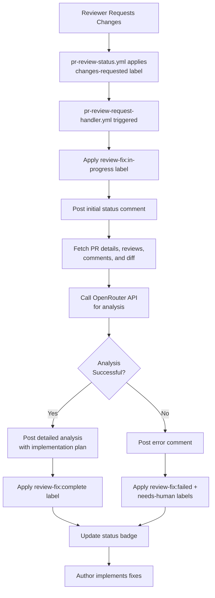

# PR Review Request Automation

**Version:** 1.0.0  
**Status:** Active  
**Owner:** @midnghtsapphire  
**Last Updated:** May 2, 2026

---

## Overview

The PR Review Request Automation system automatically handles pull requests that receive "changes requested" feedback from reviewers. When reviewers request changes, the system uses OpenRouter to analyze all feedback, generate actionable fixes, and provide a detailed implementation plan.

### Key Features

1. **Automatic Trigger** — Activates when PR receives "changes-requested" review status
2. **Comprehensive Analysis** — Analyzes all review comments, line-level feedback, and PR diff
3. **OpenRouter-Powered** — Uses AI (via OpenRouter API) to generate fix recommendations
4. **Priority-Based** — Categorizes issues by priority (P0 critical, P1 high, P2 minor)
5. **Status Tracking** — Updates labels and badges to show fix progress
6. **Human-Friendly** — Provides clear, actionable guidance for PR authors

---

## How It Works

### Workflow Sequence



### Trigger Conditions

The workflow triggers when:

1. **A review is submitted** with state `CHANGES_REQUESTED`, OR
2. **The `changes-requested` label is manually added** to a PR

The workflow will NOT run if:
- The PR has the `no-triage` label (manual opt-out)
- `OPENROUTER_API_KEY` is not configured

---

## Labels

### Review Fix Status Labels

The system uses these labels to track the fix process:

| Label | Color | Meaning | When Applied |
|-------|-------|---------|--------------|
| `review-fix:in-progress` |  Yellow | OpenRouter is analyzing feedback | When workflow starts |
| `review-fix:complete` |  Green | Analysis complete, recommendations posted | When OpenRouter succeeds |
| `review-fix:failed` |  Red | Automated analysis failed | When OpenRouter fails |

### Related Labels

- `changes-requested` — Applied by `pr-review-status.yml` when reviewer requests changes
- `openrouter` — Routing label indicating OpenRouter involvement
- `auto-fix` — Indicates automated fix attempt
- `needs-human` — Applied on failure, requires manual intervention

---

## Analysis Output

The OpenRouter analysis includes:

### 1. Review Feedback Summary
Brief overview of what all reviewers requested

### 2. Priority Issues (P0 - Critical)
Critical security, bug, or blocking issues that must be fixed before merge

### 3. Important Issues (P1 - High Priority)
Code quality, maintainability, or architectural concerns

### 4. Minor Issues (P2 - Nice to Have)
Style, documentation, or minor improvements

### 5. Implementation Plan
Step-by-step plan to address all issues, with:
- Code snippets showing fixes
- File paths and line numbers
- Explanation of why each change is needed

### 6. Recommended Next Steps
What should happen next (apply fixes, request re-review, etc.)

---

## Example Workflow

### 1. Reviewer Requests Changes

Alice reviews Bob's PR and clicks "Request changes" with feedback:

```markdown
Please address these issues:

1. Security: The API key is exposed in the code (line 45)
2. Add error handling for the network request (line 78)
3. Update the README with usage examples
```

### 2. System Activates

- `pr-review-status.yml` detects the review and applies `changes-requested` label
- `pr-review-request-handler.yml` triggers automatically
- Label `review-fix:in-progress` is applied
- Initial status comment is posted:

```markdown
🤖 **OpenRouter Review Request Handler**

Analyzing review feedback and generating fixes...

PR: #123
Model: `anthropic/claude-sonnet-4`

_This is an automated response. A detailed analysis will be posted shortly._
```

### 3. OpenRouter Analyzes

The system:
- Fetches all review comments (top-level and line-level)
- Retrieves the PR diff
- Sends everything to OpenRouter with a specialized prompt
- Receives comprehensive analysis

### 4. Analysis Posted

A detailed comment is posted:

```markdown
## 🔍 OpenRouter Review Analysis

### Review Feedback Summary

Three main concerns were raised by @alice:
1. Security vulnerability (exposed API key)
2. Missing error handling
3. Documentation gap

### Priority Issues (P0 - Critical)

**1. Exposed API Key (Security)**

**File:** `src/api-client.js` (line 45)
**Risk:** High - API key hardcoded in source
**Fix:**
```javascript
// ❌ Current (INSECURE)
const apiKey = "sk-abc123def456";

// ✅ Fixed
const apiKey = process.env.API_KEY;
if (!apiKey) {
  throw new Error("API_KEY environment variable is required");
}
```

### Important Issues (P1 - High Priority)

**2. Missing Error Handling**

**File:** `src/api-client.js` (line 78)
**Issue:** Network request can throw unhandled errors
**Fix:**
```javascript
// ❌ Current
const response = await fetch(url);
const data = await response.json();

// ✅ Fixed
try {
  const response = await fetch(url);
  if (!response.ok) {
    throw new Error(`HTTP ${response.status}: ${response.statusText}`);
  }
  const data = await response.json();
  return data;
} catch (error) {
  console.error("API request failed:", error);
  throw new Error(`Failed to fetch data: ${error.message}`);
}
```

### Minor Issues (P2 - Nice to Have)

**3. Update README**

Add usage section to `README.md`:

```markdown
## Usage

\`\`\`javascript
const client = new APIClient();
const data = await client.fetchData();
\`\`\`
```

### Implementation Plan

1. **Fix API key exposure (P0):**
   - Move API key to `.env` file
   - Update code to read from `process.env.API_KEY`
   - Add `.env.example` file
   - Update deployment docs with secret setup

2. **Add error handling (P1):**
   - Wrap fetch call in try-catch
   - Check HTTP status codes
   - Provide meaningful error messages
   - Log errors for debugging

3. **Update README (P2):**
   - Add Usage section with code example
   - Document environment variables
   - Add troubleshooting guide

### Recommended Next Steps

1. Apply the fixes above to your branch
2. Test locally to ensure no regressions
3. Push updated code to this PR
4. Request re-review from @alice

---

_Analysis generated by anthropic/claude-sonnet-4 via OpenRouter_
```text

### 5. Labels Updated

- `review-fix:in-progress` → Removed
- `review-fix:complete` → Applied
- Status badge updated to show completion

### 6. Author Implements Fixes

Bob reviews the analysis, applies the fixes, pushes updates, and requests re-review from Alice.

---

## Configuration

### Required Secrets

The workflow requires `OPENROUTER_API_KEY` to be configured:

1. Go to **Settings** → **Secrets and variables** → **Actions**
2. Add new secret: `OPENROUTER_API_KEY`
3. Value: Your OpenRouter API key

### Optional Configuration

#### Change the AI Model

Edit `.github/workflows/pr-review-request-handler.yml`:

```yaml
MODEL: anthropic/claude-sonnet-4  # Change to your preferred model
```

Available models:
- `anthropic/claude-sonnet-4` (default, best balance)
- `anthropic/claude-opus-4` (most capable, higher cost)
- `openai/gpt-4-turbo` (OpenAI alternative)
- `google/gemini-pro` (Google alternative)

#### Opt Out of Automation

To skip automation for a specific PR, add the `no-triage` label:

```bash
gh pr edit <PR_NUMBER> --add-label "no-triage"
```

---

## Integration with Other Workflows

### pr-auto-review.yml

- **Purpose:** Automatically submits initial code reviews on PRs that need review
- **Relationship:** Complementary; pr-auto-review submits initial reviews, this workflow handles change requests

### pr-review-status.yml

- **Purpose:** Manages review status labels (`awaiting-approval`, `changes-requested`, etc.)
- **Relationship:** Applies the `changes-requested` label that triggers this workflow

### openrouter-triage.yml

- **Purpose:** General issue/PR triage and routing
- **Relationship:** Independent but complementary; both use OpenRouter

### ralph-loop.yml

- **Purpose:** CI failure auto-fix
- **Relationship:** Handles CI failures; this workflow handles review feedback

### ready-for-review.yml

- **Purpose:** Auto-promotes draft PRs
- **Relationship:** Runs before review; this runs after review

---

## Troubleshooting

### Workflow Not Triggering

**Issue:** Workflow doesn't run when changes are requested

**Solutions:**
1. Check if `OPENROUTER_API_KEY` is configured
2. Verify the `changes-requested` label was applied
3. Check for `no-triage` label (blocks automation)
4. Look at Actions tab for error messages
5. Ensure workflow file is on the default branch

### Analysis Failed

**Issue:** Label shows `review-fix:failed`

**Solutions:**
1. Check OpenRouter API status: <https://openrouter.ai/status>
2. Verify API key is valid and has credits
3. Check workflow run logs for error details
4. Check if PR diff is too large (>10KB truncated automatically)
5. Retry by removing and re-adding `changes-requested` label

### Poor Quality Analysis

**Issue:** Analysis is generic or misses important points

**Solutions:**
1. Switch to a more capable model (`claude-opus-4` or `gpt-4-turbo`)
2. Ensure reviewers provide clear, specific feedback
3. Add more context in the PR description
4. Break large PRs into smaller, focused changes

### Analysis Too Slow

**Issue:** Takes too long to post analysis

**Causes:**
- Large PR with many files changed
- Complex feedback requiring detailed analysis
- OpenRouter API rate limiting

**Solutions:**
1. Switch to a faster model (`claude-haiku` or `gpt-4-turbo`)
2. Break large PRs into smaller ones
3. Reduce max_tokens in the script (currently 4000)

---

## Best Practices

### For PR Authors

1. **Write clear PR descriptions** — Help OpenRouter understand the context
2. **Keep PRs focused** — Smaller PRs get better analysis
3. **Review the analysis** — Don't blindly apply suggestions; verify they're correct
4. **Test your fixes** — Always test locally before pushing updates
5. **Request re-review** — After fixing issues, explicitly request re-review

### For Reviewers

1. **Be specific** — Clear, actionable feedback gets better analysis
2. **Explain why** — Help OpenRouter understand the reasoning
3. **Link to docs** — Reference style guides, security policies, etc.
4. **Prioritize issues** — Indicate what's critical vs. nice-to-have
5. **Use code suggestions** — GitHub's suggestion feature works well with this system

### For Repository Maintainers

1. **Monitor API usage** — Check OpenRouter credits and set up alerts
2. **Review analysis quality** — Periodically check if suggestions are helpful
3. **Tune the model** — Experiment with different models for your needs
4. **Set expectations** — Document this workflow in CONTRIBUTING.md
5. **Provide feedback** — Report issues or improvements to @midnghtsapphire

---

## Metrics & Monitoring

### Success Metrics

Track these to measure effectiveness:

- **Analysis success rate** — % of PRs where analysis completes successfully
- **Time to analysis** — How long from review to analysis posted
- **Fix adoption rate** — % of suggestions actually implemented
- **Re-review turnaround** — Time from analysis to re-review
- **Review approval rate** — % of PRs approved after fixes

### Monitoring

**Via GitHub Actions:**
```bash
# List recent runs
gh run list --workflow=pr-review-request-handler.yml

# View specific run
gh run view <RUN_ID>

# Check logs
gh run view <RUN_ID> --log
```

**Via Labels:**
```bash
# Count PRs with review-fix labels
gh pr list --label "review-fix:complete"
gh pr list --label "review-fix:failed"
gh pr list --label "review-fix:in-progress"
```

---

## Cost Estimation

Approximate costs per PR (varies by model and PR size):

| Model | Cost per Analysis | When to Use |
|-------|-------------------|-------------|
| `claude-haiku` | $0.01 - $0.05 | Small PRs, fast feedback |
| `claude-sonnet-4` | $0.10 - $0.50 | Most PRs (recommended default) |
| `claude-opus-4` | $0.50 - $2.00 | Complex PRs, critical analysis |
| `gpt-4-turbo` | $0.20 - $1.00 | Alternative to Claude |

**Budget planning:**
- 100 PRs/month × $0.30 avg = $30/month
- Set OpenRouter usage limits to control costs

---

## Related Documentation

- [PR Review Status Automation](PR_REVIEW_STATUS_AUTOMATION.md) — Review label management
- [OpenRouter Triage Process](OPENROUTER_TRIAGE_PROCESS.md) — General triage flow
- [Ralph Loop Self-Healing](../skills/ralph-loop/SKILL.md) — CI failure handling
- [AGENTS.md](../AGENTS.md) — Universal agent instructions and automation policy

---

## Support

For issues, questions, or feature requests:

1. Check the troubleshooting section above
2. Review workflow runs in the Actions tab
3. Open an issue in `midnghtsapphire/revvel-standards` with the `automation` label
4. Tag `@copilot` or `@openrouter` for assistance

---

## Changelog

### v1.0.0 — May 2, 2026

**Initial Release**

- ✅ Automatic trigger on `changes-requested` review
- ✅ OpenRouter-powered analysis with Claude Sonnet 4
- ✅ Priority-based issue categorization (P0/P1/P2)
- ✅ Detailed implementation plan with code snippets
- ✅ Status tracking with labels and badges
- ✅ Error handling and human escalation
- ✅ Comprehensive documentation

---

**Last Updated:** May 2, 2026  
**Maintained By:** MIDNGHTSAPPHIRE Team  
**Status:** Production Ready
