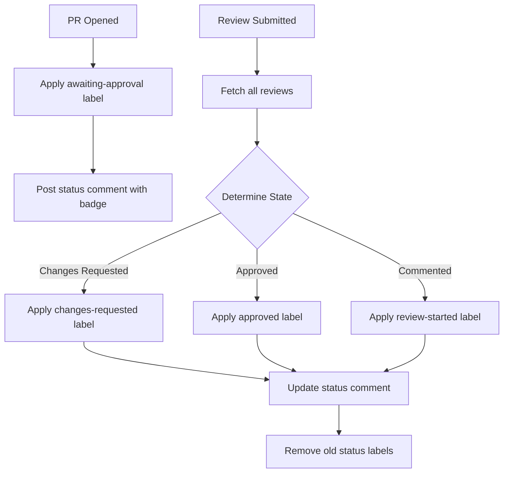

# PR Review Status Automation Guide

Complete guide to the automated PR review status management system using GitHub Actions, labels, and status badges.

## Overview

The PR Review Status Automation system automatically tracks and visualizes the review state of pull requests using:

1. **Automated Labels** — PRs are automatically labeled based on their review state
2. **Status Badges** — Visual badges show current review status in PR comments
3. **Review Tracking** — Aggregates reviews from multiple reviewers to determine overall state
4. **Notifications** — Alerts team members when review states change

## Watchdog Agent Repair Routing

The `stuck-label-watchdog.yml` workflow no longer only removes conflicting
labels. When it detects a broken or stale PR state, it now:

1. Applies the immediate safe repair on the PR, such as removing
   `awaiting-review` (and its synonyms `awaiting-approval` /
   `status:waiting-for-review`) when `approved` is already present.
2. For the `awaiting-review` + `approved` race — which the safe repair fully
   heals — the **first** self-heal on a given head SHA is **silent**: no
   `lifecycle:stuck`, no repair issue, no visible PR comment. The watchdog only
   drops a hidden `watchdog-silent-repair:awaiting-review-approved:<sha>` marker
   so it can recognize the same conflict returning later.
3. Escalates (adds `lifecycle:stuck`, opens/reuses a deduped repair issue,
   comments on the PR) only when a conflict is genuinely stuck — either a
   non-self-healable conflict, or the `awaiting-review` + `approved` conflict
   **recurring on the same head SHA** (no new commit), which proves a workflow
   path is actively re-adding the stale label and needs a real code fix rather
   than another cosmetic sweep.
4. Labels each escalated repair issue with `agent-fallback`, `auto-fix`,
   `openrouter`, `role:orchestrator`, and `bug`.

Those labels wake the `agent-fallback.yml` workflow, which routes the repair
through OpenRouter first, then Cursor, then OpenHands when explicitly opted in.
This gives every escalated watchdog finding an assignable agent task with target
PR, head SHA, applied fix, and acceptance criteria — while transient races are
healed quietly so the queue is not spammed with one-off noise every hour.

Current watchdog-routed states:

| Watchdog finding | Immediate repair | Escalation / agent follow-up |
|---|---|---|
| `awaiting-review` + `approved` (first time on a head SHA) | Remove `awaiting-review` + synonyms, restore approval | **None — silent self-heal** (hidden per-SHA marker recorded) |
| `awaiting-review` + `approved` (recurs on same head SHA) | Same safe repair | Add `lifecycle:stuck` + open repair issue: inspect review/auto-approve/synchronize paths re-adding review state after approval |
| `approved` + `needs-action` | Remove `needs-action` | Verify no stale changes-requested path reintroduced action-needed state |
| `checks-passing` + `checks-failing` | Query live CI and remove the stale check label | Patch check-suite/check-run race or stale-label path |
| `ready-to-merge` without `approved` | Remove `ready-to-merge` | Ensure merge-ready promotion always requires approval |
| `awaiting-review` for 24+ hours | Add `lifecycle:stuck` | Assign an agent to review/request reviewer action or fix missing review automation |
| `checks-failing` for 12+ hours | Add `lifecycle:stuck` | Assign an agent to read logs and patch the PR/workflow |

## Review Status Labels

The system uses four primary labels to track PR review state:

| Label | Color | Meaning | Applied When |
|-------|-------|---------|--------------|
| `awaiting-approval` |  Yellow | PR needs review | PR opened or all reviews dismissed |
| `review-started` |  Blue | Review in progress | First review comment submitted |
| `changes-requested` |  Red | Reviewer requested changes | Any reviewer requests changes |
| `approved` |  Green | PR approved | All active reviews are approvals |

### Label Precedence

When multiple review states exist, labels follow this priority (highest to lowest):

1. **changes-requested** — If ANY reviewer requested changes
2. **approved** — If ALL reviews are approvals (no pending changes)
3. **review-started** — If reviews exist but no approvals/changes
4. **awaiting-approval** — Default state when no reviews exist

## How It Works

### Workflow Triggers

The `pr-review-status.yml` workflow is triggered by:

- `pull_request` events: `opened`, `reopened`, `ready_for_review`
- `pull_request_review` events: `submitted`, `edited`, `dismissed`
- `pull_request_review_comment` events: `created`

### Automated Flow



### Status Comment Format

A comment is automatically posted/updated on each PR showing:

```markdown
## 📊 PR Review Status


**Current State:** PR has been approved ✅

**Reviewers:**
✅ **@reviewer1** — Approved
🔴 **@reviewer2** — Changes Requested
💬 **@reviewer3** — Commented

---
_This status is updated automatically by the PR Review Status Automation workflow._
```

## Setup Instructions

### 1. Copy Workflow to Your Repository

```bash
# From revvel-standards repository
cp .github/workflows/pr-review-status.yml YOUR_REPO/.github/workflows/

# Commit and push
cd YOUR_REPO
git add .github/workflows/pr-review-status.yml
git commit -m "feat: add PR review status automation"
git push
```

### 2. Sync Review Status Labels

The workflow automatically creates labels on first run, but you can manually create them:

```bash
# Set your repository
REPO="owner/repository"

# Create review status labels
gh label create "awaiting-approval" \
  --color "fbca04" \
  --description "PR is awaiting review and approval" \
  --repo $REPO

gh label create "changes-requested" \
  --color "d93f0b" \
  --description "PR has changes requested by reviewers" \
  --repo $REPO

gh label create "approved" \
  --color "0e8a16" \
  --description "PR has been approved by reviewers" \
  --repo $REPO

gh label create "review-started" \
  --color "0075ca" \
  --description "PR review has been initiated" \
  --repo $REPO
```

### 3. Enable GitHub Actions

Ensure GitHub Actions are enabled in your repository:

1. Go to **Settings** → **Actions** → **General**
2. Under "Actions permissions", select **Allow all actions and reusable workflows**
3. Under "Workflow permissions", ensure **Read and write permissions** is selected

### 4. Configure Branch Protection (Optional)

To enforce review requirements:

1. Go to **Settings** → **Branches**
2. Add a branch protection rule for `main` (or your default branch)
3. Enable **Require a pull request before merging**
4. Set **Required approving reviews** to 1 or more
5. Enable **Require review from Code Owners** (optional)

## Usage

### For PR Authors

1. **Open a PR** — The `awaiting-approval` label is automatically applied
2. **Monitor status** — Check the status comment for current review state
3. **Address feedback** — When changes are requested, make updates and push
4. **Merge when ready** — When `approved` label appears, PR is ready to merge

### For Reviewers

1. **Review the PR** — Use GitHub's review feature
2. **Submit your review**:
   - **Approve** — If changes look good
   - **Request changes** — If modifications needed
   - **Comment** — For questions or suggestions without blocking
3. **Labels update automatically** — Status reflects your review immediately

### Manual Label Management

If you need to manually adjust labels:

```bash
# Add a label
gh pr edit <PR_NUMBER> --add-label "changes-requested"

# Remove a label
gh pr edit <PR_NUMBER> --remove-label "awaiting-approval"

# Or use the GitHub UI: Labels section in the right sidebar
```

## Integration with Other Workflows

### Ready for Review Workflow

The PR Review Status Automation works alongside the existing `ready-for-review.yml` workflow:

- **ready-for-review.yml** — Manages the `in-review` label on linked issues
- **pr-review-status.yml** — Manages review state labels on the PR itself

Both workflows complement each other and should be used together.

### Auto-Merge Workflow

Combine with auto-merge for fully automated merging:

```yaml
# In auto-merge.yml or similar
jobs:
  auto-merge:
    if: contains(github.event.pull_request.labels.*.name, 'approved')
    # ... auto-merge logic
```

### Branch Protection Rules

Status labels can be used in branch protection rules:

1. Go to **Settings** → **Branches** → **Add rule**
2. Under **Require status checks**, add: `Update Review Status Labels`
3. This ensures the review status is always current before merging

## Customization

### Change Badge Styles

Edit the badge URLs in `pr-review-status.yml`:

```yaml
# Current (for-the-badge style)
statusBadge = '';

# Alternatives
# Flat style
statusBadge = '';

# Flat-square style
statusBadge = '';

# Plastic style
statusBadge = '';
```

### Add Custom Review States

To add new states (e.g., `needs-design-review`):

1. Create the label:
   ```bash
   gh label create "needs-design-review" \
     --color "7057ff" \
     --description "Requires design team review"
   ```

2. Update the workflow logic in `pr-review-status.yml`:
   ```javascript
   // Add to reviewLabels array
   const reviewLabels = ['awaiting-approval', 'changes-requested', 'approved', 
                         'review-started', 'needs-design-review'];
   
   // Add custom logic to determine when to apply
   if (/* your condition */) {
     targetLabel = 'needs-design-review';
     statusBadge = '';
     statusText = '**Current State:** Awaiting design team review';
   }
   ```

### Integrate with Slack/Discord

Add notification steps to send alerts to your team chat:

```yaml
- name: Notify on Slack
  if: steps.determine-review-state.outputs.review_status == 'approved'
  uses: slackapi/slack-github-action@v1.24.0
  with:
    webhook-url: ${{ secrets.SLACK_WEBHOOK_URL }}
    payload: |
      {
        "text": "PR #${{ github.event.pull_request.number }} has been approved! 🎉"
      }
```

## Troubleshooting

### Labels Not Updating

**Issue:** Labels don't change when reviews are submitted

**Solutions:**
1. Check workflow permissions: Settings → Actions → Workflow permissions → Read and write
2. Verify the workflow file is on the default branch (`main`)
3. Check Actions tab for workflow run errors
4. Ensure required labels exist (workflow creates them automatically on first run)

### Status Comment Not Posting

**Issue:** The status badge comment doesn't appear on PRs

**Solutions:**
1. Check if bot has permission to comment: Settings → Actions → Workflow permissions
2. Look for the workflow run in Actions tab and check for errors
3. Ensure `pull-requests: write` permission is granted in workflow file
4. Check if the repository requires approval for first-time contributors

### Wrong Label Applied

**Issue:** The label doesn't match the actual review state

**Solutions:**
1. Manually dismiss stale reviews: PR page → Reviews section → Dismiss
2. Re-request review from reviewers
3. Manually remove incorrect label and trigger workflow by pushing a commit
4. Check if multiple reviewers have conflicting states (changes-requested takes precedence)

### Workflow Not Triggering

**Issue:** Workflow doesn't run when PRs are opened or reviewed

**Solutions:**
1. Ensure workflow file is in `.github/workflows/` directory
2. Check the default branch has the workflow file
3. Verify triggers are correct: `pull_request`, `pull_request_review`, etc.
4. Check Actions tab for any disabled workflows
5. Enable Actions if disabled: Settings → Actions → General

## FAQ

**Q: Can I use this with draft PRs?**

A: Yes, but the workflow only activates when a draft PR is marked "Ready for review". Draft PRs don't receive review status labels until promoted.

**Q: What happens if a reviewer dismisses their review?**

A: The workflow recalculates the status based on remaining active reviews. If no reviews remain, the label changes back to `awaiting-approval`.

**Q: Can I manually override the labels?**

A: Yes, but the workflow will overwrite your changes on the next review event. For permanent changes, modify the workflow logic.

**Q: Does this work with CODEOWNERS files?**

A: Yes! The workflow tracks all reviews regardless of whether they're from code owners or regular reviewers.

**Q: What if I want different approval thresholds?**

A: Modify the workflow logic to check the number of approvals:
```javascript
const approvalCount = Array.from(reviewerStates.values())
  .filter(r => r.state === 'APPROVED').length;

if (approvalCount >= 2) {
  targetLabel = 'approved';
}
```

**Q: Can this integrate with external review tools?**

A: The workflow relies on GitHub's native review system. External tools that create GitHub reviews will work automatically. Tools that use external review systems would need custom integration.

## Best Practices

1. **Use with Branch Protection** — Combine with branch protection rules requiring approvals
2. **Set Clear Review Guidelines** — Document when to approve vs. request changes
3. **Respond to Review Requests** — Keep PRs moving by responding promptly
4. **Dismiss Stale Reviews** — When significant changes are made, dismiss old reviews
5. **Use Review Comments** — Provide context with your reviews to help authors
6. **Monitor Status Comments** — Check the status badge to know when PRs need attention

## Related Workflows

- [`ready-for-review.yml`](ready-for-review.yml) — Auto-promotes draft PRs and labels linked issues
- [`arsc-labels.yml`](arsc-labels.yml) — General label management (add/remove/set/clear)
- [`pr-labels.yml`](templates/cicd/pr-labels.yml) — Label-driven CI automation
- [`auto-merge.yml`](auto-merge.yml) — Automatic merging when criteria are met
- [`pr-auto-review.yml`](../.github/workflows/pr-auto-review.yml) — **NEW:** Automated review submission via OpenRouter
- [`pr-review-request-handler.yml`](../.github/workflows/pr-review-request-handler.yml) — Automated review feedback analysis via OpenRouter

### PR Auto Review Integration

When a PR needs review (has `awaiting-approval` label), the `pr-auto-review.yml` workflow automatically:
1. Analyzes PR diff and files changed
2. Uses OpenRouter AI to perform code review
3. Submits a formal GitHub review with inline comments
4. Provides APPROVE, REQUEST_CHANGES, or COMMENT assessment
5. Helps get PRs reviewed faster with automated initial feedback

See [PR_AUTO_REVIEW_AUTOMATION.md](PR_AUTO_REVIEW_AUTOMATION.md) for complete documentation.

### PR Review Request Handler Integration

When a reviewer requests changes, the `pr-review-request-handler.yml` workflow automatically:
1. Analyzes all review feedback and PR diff
2. Uses OpenRouter AI to generate fix recommendations
3. Posts detailed implementation plan with code snippets
4. Categorizes issues by priority (P0/P1/P2)
5. Updates labels to track fix progress

See [PR_REVIEW_REQUEST_AUTOMATION.md](PR_REVIEW_REQUEST_AUTOMATION.md) for complete documentation.

## Support

For issues, questions, or feature requests:

1. Check the troubleshooting section above
2. Review workflow runs in the Actions tab for error messages
3. Open an issue in `midnghtsapphire/revvel-standards` with the `automation` label
4. Tag `@copilot` or `@openrouter` for assistance

## License

This automation is part of the Revvel Standards and is available under the repository's license terms.

---

**Last Updated:** April 29, 2026  
**Maintained By:** MIDNGHTSAPPHIRE Team  
**Status:** Production Ready
