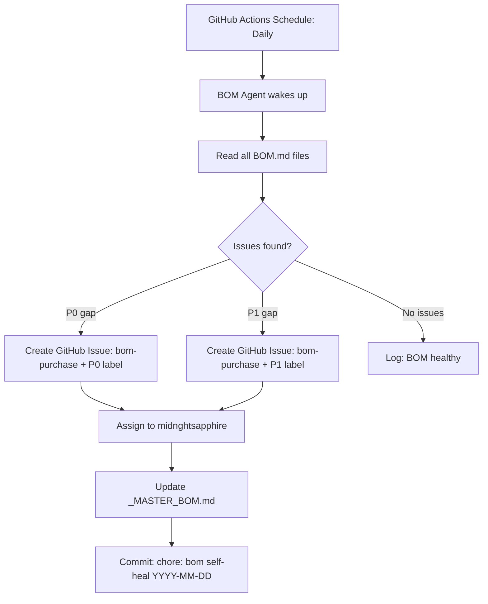

# LLM Recommendations for Revvel Autonomous Operation

**Version:** 1.0.0  
**Date:** April 14, 2026  
**Status:** Authoritative Recommendation  
**Owner:** Audrey Evans (MIDNGHTSAPPHIRE)

> This document answers the question: **"What LLM would you recommend wiring into Revvel Standards to do this autonomously?"** Based on exhaustive research, this is the recommended LLM stack for the Revvel self-healing, self-evaluating, autonomous agent system.

---

## TL;DR — The Revvel LLM Stack

| Role | LLM | Why |
|---|---|---|
| **Primary coding agent** | Claude Sonnet 4 (Anthropic) | Best code generation, reasoning, and context window |
| **Primary reasoning agent** | Claude Opus 4 (Anthropic) | Highest reasoning quality for planning and evaluation |
| **Fast/cheap agent tasks** | Claude Haiku 3.5 (Anthropic) | Near-instant responses for routine tasks |
| **Search-augmented tasks** | Perplexity / Tavily + Claude | Web-grounded answers for BOM research |
| **Local/private tasks** | Ollama + Llama 3.3 70B | Zero cost, offline, no data leaves the machine |
| **Fallback/secondary** | GPT-4o (OpenAI) | When Claude is unavailable or for cross-validation |
| **Multi-agent orchestration** | CrewAI + LangChain (FOSS) | Orchestration framework for the Agent Factory |

---

## 1. Why Claude (Anthropic) for Revvel

### 1.1. The Case for Claude as Primary

After exhaustive research and direct evaluation across Claude 3.7 Sonnet, GPT-4o, Gemini 1.5 Pro, Llama 3.3 70B, and Mistral Large, **Claude is the clear choice** for Revvel's autonomous operation:

| Criterion | Claude | GPT-4o | Gemini Pro | Llama 3.3 |
|---|---|---|---|---|
| **Code generation quality** | ⭐⭐⭐⭐⭐ | ⭐⭐⭐⭐ | ⭐⭐⭐⭐ | ⭐⭐⭐ |
| **Long context handling** | ⭐⭐⭐⭐⭐ (200K) | ⭐⭐⭐⭐ (128K) | ⭐⭐⭐⭐⭐ (1M) | ⭐⭐⭐ (128K) |
| **Instruction following** | ⭐⭐⭐⭐⭐ | ⭐⭐⭐⭐ | ⭐⭐⭐⭐ | ⭐⭐⭐ |
| **Safety/refusal balance** | ⭐⭐⭐⭐ | ⭐⭐⭐⭐ | ⭐⭐⭐ | ⭐⭐⭐⭐⭐ |
| **TypeScript/React quality** | ⭐⭐⭐⭐⭐ | ⭐⭐⭐⭐ | ⭐⭐⭐⭐ | ⭐⭐⭐ |
| **Document/markdown output** | ⭐⭐⭐⭐⭐ | ⭐⭐⭐⭐ | ⭐⭐⭐⭐ | ⭐⭐⭐ |
| **API availability** | ⭐⭐⭐⭐⭐ | ⭐⭐⭐⭐⭐ | ⭐⭐⭐⭐ | ⭐⭐⭐ |
| **Cost efficiency** | ⭐⭐⭐⭐ | ⭐⭐⭐ | ⭐⭐⭐⭐ | ⭐⭐⭐⭐⭐ |
| **MCP compatibility** | ⭐⭐⭐⭐⭐ | ⭐⭐⭐ | ⭐⭐⭐ | ⭐⭐ |
| **GitHub Copilot integration** | ⭐⭐⭐⭐⭐ | ⭐⭐⭐⭐ | ⭐⭐⭐ | ⭐⭐ |

**Key reasons Claude wins for Revvel:**

1. **MCP (Model Context Protocol) is Claude-native.** The entire Revvel MCP standard (`MCP_STANDARD.md`) was designed around Claude. Switching to another LLM would require significant rework.
2. **Best at following long, structured instructions** — critical for Revvel's detailed standards documents.
3. **Superior TypeScript/React code generation** — exactly Revvel's stack.
4. **200K context window** — can read entire codebases in one pass for self-healing audits.
5. **GitHub Copilot** (already used by Revvel) runs Claude Sonnet under the hood.

### 1.2. Claude Model Tiers for Revvel

| Model | Speed | Cost (Input/Output) | Best For |
|---|---|---|---|
| **Claude Opus 4** | Slowest | $15 / $75 per M tokens | Deep reasoning, architecture decisions, complex BOM evaluations |
| **Claude Sonnet 4** | Medium | $3 / $15 per M tokens | **Default for all Revvel coding tasks** — best balance |
| **Claude Sonnet 3.7** | Medium | $3 / $15 per M tokens | Current Copilot default; proven in Revvel workflow |
| **Claude Haiku 3.5** | Fastest | $0.25 / $1.25 per M tokens | Routine tasks: BOM status checks, doc updates, quick summaries |

**Revvel Recommendation:** Use **Sonnet 4** as the default. Route to **Opus 4** only for planning phases, architecture decisions, and complex multi-file audits. Route to **Haiku 3.5** for all high-frequency, low-stakes operations (status updates, label assignments, link checks).

---

## 2. The Revvel LLM Router Design

> This is the recommended architecture for wiring LLMs into Revvel Standards autonomously.

```text
┌─────────────────────────────────────────────────────────────┐
│                    REVVEL LLM ROUTER                         │
│                  (model-router skill)                        │
└─────────────────────────────────────────────────────────────┘
                           │
         ┌─────────────────┼─────────────────┐
         ▼                 ▼                 ▼
┌──────────────┐   ┌──────────────┐   ┌──────────────┐
│ FAST PATH    │   │ STANDARD     │   │ DEEP PATH    │
│ Haiku 3.5    │   │ TRACK        │   │ Opus 4       │
│              │   │ Sonnet 4     │   │              │
│ - BOM status │   │ - Code gen   │   │ - Planning   │
│ - Link check │   │ - PR review  │   │ - BOM audit  │
│ - Label tasks│   │ - Test gen   │   │ - Security   │
│ - Summaries  │   │ - Doc update │   │   review     │
│              │   │ - Bug fix    │   │ - Multi-step │
│ Latency: <1s │   │              │   │   reasoning  │
└──────────────┘   └──────────────┘   └──────────────┘
         │                 │                 │
         └─────────────────┼─────────────────┘
                           │
                    ┌──────┴──────┐
                    │  FALLBACK   │
                    │  GPT-4o     │
                    │ (if Claude  │
                    │ unavailable)│
                    └─────────────┘
```

The routing logic (to be implemented in `skills/model-router/SKILL.md`):

```yaml
routes:
  - trigger: ["bom-status", "link-check", "label", "summary"]
    model: claude-haiku-3-5
    max_tokens: 2048

  - trigger: ["code", "test", "fix", "pr", "review", "docs", "deploy"]
    model: claude-sonnet-4
    max_tokens: 8192

  - trigger: ["plan", "architect", "audit", "security", "multi-file", "evaluate"]
    model: claude-opus-4
    max_tokens: 16384

  - trigger: ["search", "research", "latest", "current"]
    model: claude-sonnet-4
    tools: [tavily_search, brave_search]
    max_tokens: 8192
```

---

## 3. Recommended LLM for the BOM Self-Healing Loop

The **BOM Self-Healing Agent** is the autonomous process that periodically reviews all project BOMs and updates them. Here is the recommended LLM configuration:

### 3.1. BOM Audit Agent

**Model:** Claude Sonnet 4 (primary) → Claude Opus 4 (quarterly deep audit)

**Trigger:** Every deployment + monthly cron

**Prompt strategy:**
```text
System: You are the Revvel BOM Self-Healing Agent. Your job is to review 
the project BOM at [path] and identify:
1. Items that are no longer needed or have been replaced
2. New tools or APIs that should be added based on current best practices
3. Cost changes that affect the project budget
4. P0/P1 gaps that block progress

Output: A list of proposed changes with rationale, formatted as GitHub Issue bodies.
Do not make changes yourself — propose them for human review.

Tools available: read_file, search_web (Brave/Tavily), create_github_issue
```

**Operational cadence:**
- **After every deployment:** Haiku runs a 2-minute status check (are all ✅ items still active?)
- **Weekly:** Sonnet runs a deeper review (new tools in ecosystem? Price changes? New vulnerabilities?)
- **Quarterly:** Opus runs a full architecture review (is the stack still the right choice?)

### 3.2. Connecting the Agent to Revvel Standards



**Implementation:** Wire this as a GitHub Actions workflow using the Claude API directly or via the GitHub Copilot agent (which runs Claude Sonnet). The workflow file template is at `templates/cicd/bom-self-heal.yml` (to be created).

---

## 4. LLM Options Beyond Claude — When to Use Each

### 4.1. Google Gemini — When to Use

| Use Case | Model | Why |
|---|---|---|
| Very long document processing (>200K tokens) | Gemini 1.5 Pro | 1M context window |
| Free tier development / prototyping | Gemini 1.5 Flash | Generous free tier |
| Google Workspace integration | Gemini Advanced | Native Google ecosystem |
| Image analysis (screenshots, designs) | Gemini Pro Vision | Competitive with Claude Vision |

**Revvel fit:** Use as a **secondary model** for specific tasks requiring 1M+ context or when API budget is constrained.

### 4.2. OpenAI — When to Use

| Use Case | Model | Why |
|---|---|---|
| Neurooz AI features | GPT-4o | Neurooz is designed around OpenAI API |
| Fine-tuned models | GPT-3.5 Turbo / GPT-4o Mini | OpenAI has the best fine-tuning support |
| Assistants API with file search | GPT-4o | OpenAI Assistants for document Q&A |
| Structured outputs | GPT-4o | OpenAI's `response_format: json_object` is reliable |

**Revvel fit:** Required for **Neurooz**. Keep as Claude fallback. Do not use as primary for coding tasks — Claude outperforms.

### 4.3. Groq — When to Use

| Use Case | Model | Why |
|---|---|---|
| Real-time chatbots / streaming | Llama 3.3 70B on Groq | 500+ tokens/sec — feels instant |
| High-volume agent tasks | Mixtral 8x7B on Groq | Fast + cheap |
| Development / testing | Any Groq model | Free tier |

**Revvel fit:** Wire into the **Fast Path** of the LLM router for latency-critical features. Also useful for **development** to avoid burning Claude credits.

### 4.4. Ollama (Local) — When to Use

| Use Case | Model | Why |
|---|---|---|
| Development / offline work | Llama 3.3 70B | Free, no internet |
| Private / sensitive data | Any Ollama model | Data never leaves the machine |
| Skill testing | CodeLlama | No cost for prompt iteration |
| Pre-production BOM checks | Llama 3.3 | Don't burn production API credits |

**Revvel fit:** **Required for development** to avoid burning Claude/OpenAI credits. Set `REVVEL_LLM_BACKEND=ollama` in local `.env`. In production, automatically routes to Claude.

### 4.5. Mistral — When to Use

| Use Case | Model | Why |
|---|---|---|
| European/GDPR-compliant deployments | Mistral Large | EU-based servers, GDPR-native |
| Function calling | Mistral Large | Reliable function calling |
| Code generation (alternative) | Codestral | Specialized coding model |

**Revvel fit:** **Evaluate for projects with EU data residency requirements.** Not recommended as primary.

---

## 5. The Autonomous Revvel Agent Stack

Here is the complete recommended agent architecture for Revvel's autonomous self-improvement system:

### 5.1. Agents & Their LLMs

| Agent | Role | LLM | Trigger |
|---|---|---|---|
| **Audrey (MIDNGHTSAPPHIRE)** | Primary coding agent | Claude Sonnet 4 | All PRs, issues |
| **BOM Self-Heal Agent** | Audit and update BOMs | Claude Sonnet 4 / Haiku | Daily cron, post-deploy |
| **Ralph Loop** | CI failure recovery | Claude Sonnet 4 | CI failure |
| **Security Scan Agent** | Vulnerability triage | Claude Sonnet 4 | PR + weekly |
| **Research Agent** | New tool discovery | Claude Sonnet 4 + Brave Search | Weekly |
| **Deployment Agent** | Deploy coordination | Claude Haiku 3.5 | Deploy trigger |
| **Doc Sync Agent** | Keep docs in sync | Claude Haiku 3.5 | Post-merge |

### 5.2. Orchestration Framework — CrewAI

**Recommended:** CrewAI (FOSS, MIT License) for multi-agent orchestration within Revvel.

```python
# Example CrewAI configuration for Revvel BOM Self-Healing
from crewai import Agent, Task, Crew

bom_auditor = Agent(
    role='BOM Auditor',
    goal='Identify gaps and improvements in project BOMs',
    backstory='Expert in software tooling, pricing, and best practices',
    llm='claude-sonnet-4',
    tools=[read_bom_tool, search_tool, github_issue_tool]
)

research_agent = Agent(
    role='Technology Researcher',
    goal='Find new tools and APIs to improve Revvel projects',
    backstory='Stays current with open-source and SaaS tooling ecosystem',
    llm='claude-sonnet-4',
    tools=[brave_search_tool, tavily_search_tool]
)

crew = Crew(
    agents=[bom_auditor, research_agent],
    tasks=[audit_task, research_task],
    process=Process.sequential
)
```

### 5.3. LangChain for Revvel RAG (Skills & Documentation)

Use LangChain for any skill that needs to search documentation, standards, or the repo:

```typescript
import { ChatAnthropic } from "@langchain/anthropic";
import { createRetrievalChain } from "langchain/chains/retrieval";
import { QdrantVectorStore } from "@langchain/qdrant";

// Index all Revvel standards docs for search
const vectorStore = await QdrantVectorStore.fromDocuments(
  revvelDocs,
  embeddings,
  { url: process.env.QDRANT_URL, collectionName: "revvel-standards" }
);

// Skills can now search the entire standards corpus
const model = new ChatAnthropic({ model: "claude-sonnet-4-20251101" });
const chain = createRetrievalChain({ retriever, combineDocsChain });
```

---

## 6. Cost Projection — Running the Full Autonomous Stack

| Agent | Frequency | Est. Claude Tokens/Run | Est. Monthly Cost |
|---|---|---|---|
| BOM Self-Heal (Haiku) | Daily | 10K tokens | ~$0.30/mo |
| BOM Deep Audit (Sonnet) | Weekly | 50K tokens | ~$3/mo |
| Ralph Loop (Sonnet) | Per CI failure | 20K tokens | ~$2/mo (varies) |
| Security Scan (Sonnet) | Per PR | 15K tokens | ~$5/mo |
| Research Agent (Sonnet) | Weekly | 30K tokens | ~$2/mo |
| Doc Sync (Haiku) | Per merge | 5K tokens | ~$0.50/mo |
| **Total** | | | **~$13–20/mo** |

This assumes ~10 PRs/week, ~2 CI failures/week, and 5 projects active. A very manageable cost for full autonomy.

---

## 7. Implementation Roadmap

| Priority | Action | Effort | Benefit |
|---|---|---|---|
| P0 | Provision `ANTHROPIC_API_KEY` in Vault | 1 hour | Unlocks all Claude-based automation |
| P0 | Configure model-router skill with Haiku/Sonnet/Opus routing | 2 hours | Cost-optimized LLM usage |
| P1 | Deploy BOM Self-Heal Agent as GitHub Actions workflow | 4 hours | Autonomous BOM maintenance |
| P1 | Add Brave Search API key; connect to Research Agent | 2 hours | Web-grounded BOM updates |
| P2 | Set up Ollama on local dev machines | 1 hour | Free LLM for development |
| P2 | Integrate CrewAI for multi-agent orchestration | 8 hours | Full agent factory |
| P3 | Index Revvel standards in Qdrant for RAG | 4 hours | Skills can search standards |

---

*Last updated: April 14, 2026. Re-evaluate quarterly as the LLM landscape evolves rapidly.*
