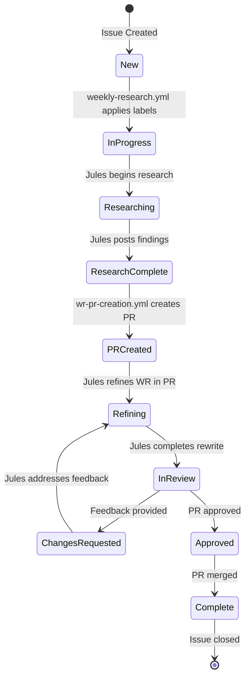

# WR (Weekly Research) Flow Diagram

**Version:** 2.0.0  
**Status:** Active  
**Last Updated:** 2026-05-03

This document visualizes the complete WR (Weekly Research) workflow from issue creation to PR merge.

---

## Complete WR Workflow

```mermaid
graph TD
    A[User Creates Issue with WR Prefix] --> B{weekly-research.yml<br/>Detects WR}
    B -->|Yes| C[Apply Labels:<br/>• weekly-research<br/>• wr:in-progress<br/>• deep-research<br/>• openrouter<br/>• role:orchestrator<br/>• jules]
    B -->|No| Z[Standard Issue Flow]
    
    C --> D[Post Welcome Comment<br/>with Checklist]
    
    D --> E[jules-invoke.yml<br/>Triggers on 'jules' Label]
    
    E --> F[Jules Performs<br/>Deep Research]
    
    F --> G[Jules Posts<br/>Research Findings<br/>as Issue Comment]
    
    G --> H[openrouter-triage.yml<br/>Analyzes Scope]
    
    H --> I[Apply Additional Labels<br/>e.g., codex, 49agents]
    
    I --> J{Research<br/>Complete?}
    
    J -->|Yes - Jules Posts<br/>Research Findings| K[wr-pr-creation.yml<br/>Triggered by Comment]
    J -->|Or Manual| L[Apply wr:complete<br/>Label]
    
    L --> K
    
    K --> M[Create WR Branch<br/>wr/issue-N-title]
    
    M --> N[Generate WR Document<br/>from Template]
    
    N --> O[Insert Jules'<br/>Research Findings]
    
    O --> P[Commit and Push]
    
    P --> Q[Create Pull Request]
    
    Q --> R[Apply PR Labels:<br/>• weekly-research<br/>• jules<br/>• documentation<br/>• wr:in-progress]
    
    R --> S[Request Jules<br/>to Rewrite PR]
    
    S --> T[Jules Reviews<br/>and Refines WR]
    
    T --> U[Jules Updates PR<br/>with Refined Content]
    
    U --> V[jules-pr-reviewer.yml<br/>Posts Review]
    
    V --> W[ai-pr-review-openrouter.yml<br/>Posts Summary]
    
    W --> X{PR<br/>Approved?}
    
    X -->|No| AA[Address Feedback]
    AA --> T
    
    X -->|Yes| Y[Merge PR to main]
    
    Y --> AB[Close Issue<br/>Apply wr:complete]
    
    AB --> AC[End: WR Complete]
    
    style A fill:#e1f5ff
    style F fill:#fff4e1
    style G fill:#fff4e1
    style T fill:#fff4e1
    style U fill:#fff4e1
    style Y fill:#e8f5e9
    style AC fill:#e8f5e9
```



---

## Phase Breakdown

### Phase 1: Issue Creation & Detection
**Duration:** < 1 minute  
**Automation:** `weekly-research.yml`

1. User creates issue with `[WR]` prefix
2. Workflow detects prefix or `weekly-research` label
3. Applies routing labels automatically
4. Posts welcome comment with research checklist

**Key Files:**
- `.github/workflows/weekly-research.yml`
- `templates/issue-template/issue.yml`

---

### Phase 2: Deep Research
**Duration:** 30 minutes - 4 hours  
**Automation:** `jules-invoke.yml`, `openrouter-triage.yml`

1. Jules is automatically invoked via `jules` label
2. Jules performs comprehensive research:
   - Reviews repository documentation
   - Cross-references org repos
   - Checks skills vault
   - Researches external tools/updates
   - Validates Prime Directive compliance
3. Jules posts structured research findings
4. OpenRouter triage provides additional routing

**Key Files:**
- `.github/workflows/jules-invoke.yml`
- `docs/WEEKLY_RESEARCH_PROCESS.md`
- `skills/REGISTRY.md`

---

### Phase 3: PR Creation
**Duration:** < 2 minutes  
**Automation:** `wr-pr-creation.yml`

**Triggers:**
- Jules posts comment containing "Research Findings:"
- `wr:complete` label is applied
- Manual workflow dispatch

**Actions:**
1. Detects research completion
2. Creates branch: `wr/issue-{N}-{clean-title}`
3. Generates WR document from template
4. Inserts Jules' research findings
5. Commits and pushes to branch
6. Opens PR with detailed description
7. Applies labels and assigns Jules for rewrite
8. Posts comment on original issue with PR link

**Key Files:**
- `.github/workflows/wr-pr-creation.yml`
- `wr/WR_TEMPLATE.md`

---

### Phase 4: Jules Rewrite & Refinement
**Duration:** 15-60 minutes  
**Automation:** `jules-action`, `jules-pr-reviewer.yml`

1. Jules is automatically invoked on the PR
2. Jules reviews the generated WR document
3. Refines content for:
   - Clarity and actionability
   - Specific implementation steps
   - Completeness and accuracy
   - Standards compliance
4. Updates PR with refined content
5. Multiple iterations possible based on feedback
6. Jules marks as ready when refinement is complete

**Key Files:**
- `.github/workflows/jules-pr-reviewer.yml`
- `.github/workflows/jules-invoke.yml`

---

### Phase 5: Review & Merge
**Duration:** Variable (depends on human review)  
**Automation:** Multiple PR review workflows

**Automatic Reviews:**
- `jules-pr-reviewer.yml` - Jules review
- `ai-pr-review-openrouter.yml` - OpenRouter summary
- `openrouter-triage.yml` - Routing verification
- `recurse-ml.yml` - Code quality checks

**Human Review:**
- Repository maintainer approval
- Audrey final sign-off

**Final Actions:**
1. PR merged to main
2. Original issue automatically closed
3. `wr:complete` label applied
4. WR document available in `wr/issues/`

**Key Files:**
- `.github/workflows/jules-pr-reviewer.yml`
- `.github/workflows/ai-pr-review-openrouter.yml`

---

## State Transitions



---

## Label Lifecycle

| Label | Applied By | When | Removed By | When |
|-------|------------|------|------------|------|
| `weekly-research` | `weekly-research.yml` | Issue opened with [WR] | Never | Permanent marker |
| `wr:in-progress` | `weekly-research.yml` | Issue opened | Merge | PR merged |
| `deep-research` | `weekly-research.yml` | Issue opened | Never | Permanent marker |
| `openrouter` | `weekly-research.yml` | Issue opened | Never | Routing marker |
| `role:orchestrator` | `weekly-research.yml` | Issue opened | Never | Routing marker |
| `jules` | `weekly-research.yml` | Issue opened | Never | Agent assignment |
| `wr:complete` | `wr-pr-creation.yml` or Manual | Research complete | Never | Completion marker |
| `in-review` | `wr-pr-creation.yml` | PR created | Merge | PR merged |
| `documentation` | `wr-pr-creation.yml` | PR created | Never | Content type marker |

---

## Workflow Dependencies

```text
weekly-research.yml (Entry Point)
    ├── Triggers: jules-invoke.yml (via 'jules' label)
    ├── Triggers: openrouter-triage.yml (via 'openrouter' label)
    └── Enables: wr-pr-creation.yml (via monitoring)

wr-pr-creation.yml (PR Generation)
    ├── Reads: Issue comments (Jules' findings)
    ├── Uses: wr/WR_TEMPLATE.md
    ├── Triggers: jules-action (PR rewrite request)
    └── Creates: PR with labels

jules-pr-reviewer.yml (PR Review)
    ├── Triggered by: PR opened/synchronized
    └── Posts: Review comments

ai-pr-review-openrouter.yml (PR Review)
    ├── Triggered by: PR opened/synchronized
    └── Posts: Summary comments
```

---

## Configuration Requirements

### Required Secrets
- `JULES_API_KEY` - Google Jules API access
- `OPENROUTER_API_KEY` - OpenRouter API access
- `GITHUB_TOKEN` - Automatically provided

### Required Labels (synced by `sync-labels.yml`)
- `weekly-research`
- `wr:in-progress`
- `wr:complete`
- `jules`
- `deep-research`
- `openrouter`
- `role:orchestrator`
- `in-review`
- `documentation`

### Required Files
- `.github/workflows/weekly-research.yml`
- `.github/workflows/wr-pr-creation.yml`
- `.github/workflows/jules-invoke.yml`
- `.github/workflows/jules-pr-reviewer.yml`
- `wr/WR_TEMPLATE.md`
- `docs/WEEKLY_RESEARCH_PROCESS.md`

---

## Monitoring & Metrics

### Success Metrics
- Time from issue open to PR creation: < 4 hours
- Jules refinement cycles: 1-3 iterations
- PR approval time: < 24 hours (human-dependent)
- Total WR completion time: < 48 hours

### Failure Modes & Recovery

| Failure | Detection | Recovery |
|---------|-----------|----------|
| Jules API unavailable | Workflow warning | Manual research or retry |
| PR creation fails | Workflow error + issue comment | Manual workflow dispatch |
| Jules doesn't post findings | Timeout (7 days via stuck-label-automation) | Human escalation |
| Branch conflict | PR creation error | Manual branch creation |
| Research incomplete | `stuck-label-automation.yml` | Auto-escalate after 3 days |

---

## Example Timeline

**Typical WR Completion:**

```text
T+0:00 - User creates [WR] issue
T+0:01 - weekly-research.yml applies labels, posts welcome
T+0:02 - jules-invoke.yml triggers Jules
T+0:05 - openrouter-triage.yml analyzes and routes
T+1:30 - Jules posts research findings (1.5 hours)
T+1:31 - wr-pr-creation.yml detects completion
T+1:32 - PR created with initial WR document
T+1:33 - Jules begins PR refinement
T+2:15 - Jules completes first refinement pass
T+2:20 - OpenRouter review posts
T+3:00 - Human review begins
T+4:00 - Human approves PR
T+4:01 - PR merged, issue closed
```

**Total:** ~4 hours (mostly automated)

---

## Related Documentation

- [WEEKLY_RESEARCH_PROCESS.md](./WEEKLY_RESEARCH_PROCESS.md) - Process overview
- [JULES_AUTO_REVIEW_ROUTING.md](./JULES_AUTO_REVIEW_ROUTING.md) - Jules routing details
- [AGENTS.md](./AGENTS.md) - Agent operating principles
- [WR_TEMPLATE.md](../wr/WR_TEMPLATE.md) - Research document template

---

## Changelog

### 2.0.0 - 2026-05-03
- Added automatic PR creation workflow
- Integrated Jules rewrite phase
- Created complete flow documentation
- Added state diagrams and metrics

### 1.0.0 - 2026-04-30
- Initial WR automation with basic labeling
- Jules deep research integration
- OpenRouter triage routing
