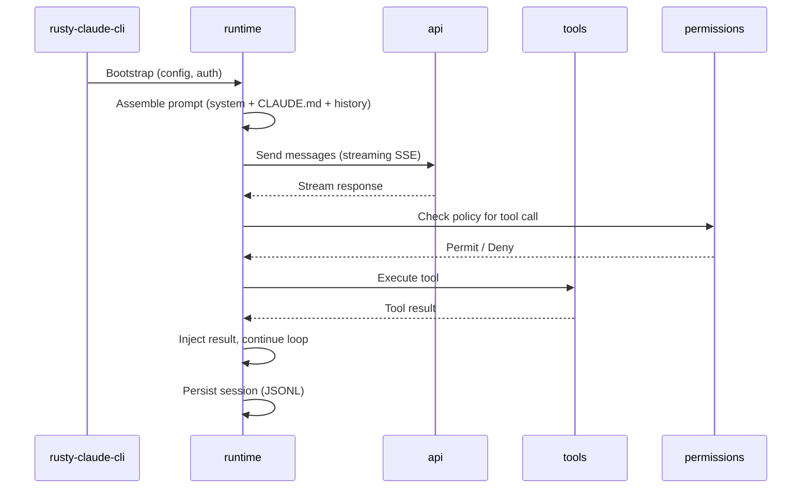

# BLUEPRINT.md — Claw Code Architecture (Revvel EXRUP Standard)

**Version**: 0.1.0 (2026-04-12)
**Status**: Active | Last Updated: 2026-04-12

## System Overview

Claw Code is a high-performance Rust CLI agent harness that turns Claude into an autonomous coding agent. It supports REPL sessions, 40+ tools, permission modes, persistent sessions, and MCP integration.

## High-Level Data Flow

1. CLI Entry → Config & Auth Load → Runtime Bootstrap
2. Prompt Assembly (system + CLAUDE.md + history) → Anthropic API (streaming SSE)
3. Tool Call Detection → Permission Policy Check → Tool Execution → Result Injection → Continue Loop
4. Final Response → Session Persistence (JSONL) → Telemetry Update → Recovery if needed

## Core Crates & Responsibilities

| Crate | Responsibility |
|---|---|
| **rusty-claude-cli** | Argument parsing, REPL (rustyline), output rendering |
| **runtime** | ConversationRuntime, session management, permissions, prompt builder, MCP lifecycle |
| **api** | Anthropic client with streaming support |
| **tools** | 40+ tool implementations + executor |
| **permissions** | PolicyEngine for read-only / workspace-write / danger modes |
| **telemetry / plugins** | Observability and future extensibility |
| **mock-anthropic-service** | Deterministic parity testing |

## Key Interfaces

- `PolicyEngine` enforces tool permissions before execution
- `Session` stores conversation as JSONL in `.claw/sessions/`
- MCP stdio bridge for external/sub-agents

## Diagrams

## See Also

- `rust/README.md`
- `docs/claw-code/CONTEXT_PRIMER.md`
- `docs/claw-code/REPOSITORY_OVERVIEW.md`
- `PHILOSOPHY.md`
