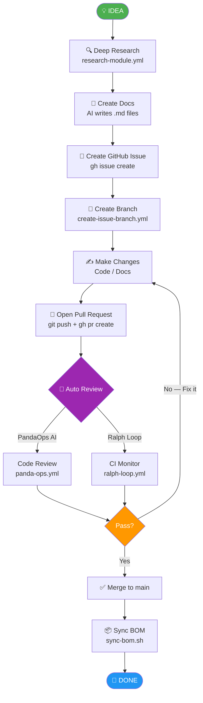
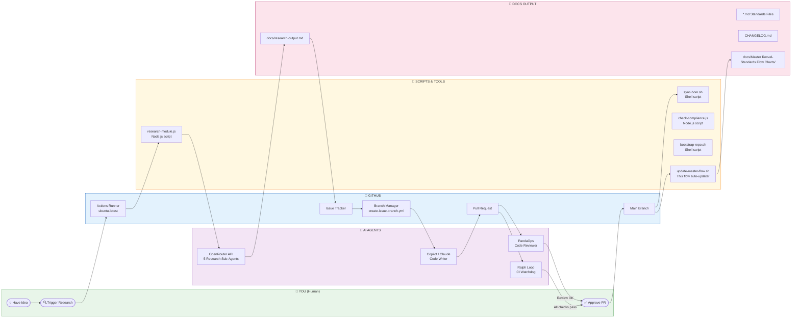

# 🗺️ Master Revvel-Standards Flow Chart

> **Auto-maintained by:** `.github/workflows/update-master-flow.yml`  
> **Last updated:** 2026-04-15 18:10 UTC
> **Repository:** midnghtsapphire/revvel-standards
> **Docs location:** docs/Master Revvel-Standards Flow Charts
> **Version:** 1.0.0

---

## 📋 What Is This?

This is **one document** that shows the entire Revvel process from **start to finish (A → B)** — written simply enough for an 8-year-old to understand, but with every fine-grained detail a developer needs.

It has **three formats** in one file:

| Format | Where |
|---|---|
| 📝 Simple text flow (1. 2. 3.) | [Section 1 — Simple Flow](#section-1--simple-flow-for-everyone) |
| 🔷 Wireframe diagram | [Section 2 — Wireframe](#section-2--wireframe-diagram) |
| 🌐 3D-style flow chart | [Section 3 — 3D Flow Chart](#section-3--3d-flow-chart) |
| 🔍 Fine-grained detail per step | [Section 4 — Detailed Steps](#section-4--fine-grained-step-by-step) |

---

## Section 1 — Simple Flow (For Everyone)

> *Think of this like a recipe. Each number is one step. You always go in order.*

```
START
  │
  1. 💡  IDEA — Someone thinks of something to build or research
  │
  2. 🔍  DEEP RESEARCH — AI agents go read everything about the topic
  │        (takes about 2–5 minutes, all automatic)
  │
  3. 📄  WRITE DOCS — AI writes the standard documents from the research
  │
  4. 🐛  CREATE ISSUE — A ticket is created in GitHub to track the work
  │
  5. 🌿  CREATE BRANCH — A safe copy of the code is made to work on
  │
  6. ✍️   MAKE CHANGES — Code or documents are written / updated
  │
  7. 🔁  PULL REQUEST — The changes are sent for review
  │
  8. 🤖  AUTO REVIEW — AI robots check the changes for mistakes
  │        (PandaOps checks code, Ralph Loop watches for errors)
  │
  9. ✅  MERGE — Changes are accepted and saved to the main branch
  │
  10. 🚀  DEPLOY — The new version goes live
  │
DONE ✨
```

---

## Section 2 — Wireframe Diagram

> *A wireframe is like a blueprint. It shows all the boxes and arrows.*



---

## Section 3 — 3D Flow Chart

> *This shows the same steps but also shows which system (GitHub, AI, Scripts, You) is doing each part.*



---

## Section 4 — Fine-Grained Step-by-Step

> *Every step below shows exactly which tool, API, script, or app is used and what it does.*

---

### STEP 1 — 💡 Have an Idea

**Who does it:** You (the human)  
**What happens:** You think of a topic, question, or feature to add to Revvel.  
**No tools needed at this step.**

---

### STEP 2 — 🔍 Deep Research

**Who does it:** GitHub Actions + OpenRouter API  
**Trigger:** You click "Run workflow" in GitHub Actions, or it triggers automatically.

| Tool / API / CLI | What It Does | Where It Lives |
|---|---|---|
| **GitHub Actions** | Runs the automated workflow on a cloud server | `.github/workflows/research-module.yml` |
| **`actions/checkout@v4`** | Downloads your code to the cloud runner | GitHub Marketplace action |
| **`actions/setup-node@v4`** | Installs Node.js 22 on the runner | GitHub Marketplace action |
| **`actions/create-github-app-token@v1`** | Creates a secure token for the GitHub App | GitHub Marketplace action |
| **`node scripts/research-module.js`** | Runs the research script | `scripts/research-module.js` |
| **OpenRouter API** (`openrouter.ai/api/v1/chat/completions`) | Routes the research question to 5 AI models simultaneously | External API — requires `OPENROUTER_API_KEY` secret |
| **5 Sub-Agents (via OpenRouter)** | Each agent covers a different angle: technical, business, security, UX, legal | Defined inside `scripts/research-module.js` |
| **`git push`** (via `GH_TOKEN`)| Saves the research document back to the repo | Built-in git CLI |
| **`gh issue create`** (GitHub CLI) | Creates a GitHub Issue summarizing the research | Built-in `gh` CLI |

**Output:** A new `.md` file in `docs/` and a new GitHub Issue.

---

### STEP 3 — 📄 Create Documentation

**Who does it:** AI agent (Claude, Copilot, or OpenRouter model)  
**Trigger:** Someone (human or AI) reads the research output and writes standards.

| Tool / API / CLI | What It Does | Where It Lives |
|---|---|---|
| **Claude (Anthropic API)** | AI model that reads research and writes `*.md` standards documents | External API — `claude.ai` or Cursor / Claude Code |
| **GitHub Copilot** | AI assistant integrated in code editor | Extension in VS Code / Cursor |
| **Cursor** | AI-first code editor that can write and commit docs | App: `cursor.sh` |
| **`git add` + `git commit`** | Saves new docs to git history | Built-in git CLI |

**Output:** New or updated `*.md` files (e.g., `SECURITY_STANDARD.md`, `API_GATEKEEPER_STANDARD.md`).

---

### STEP 4 — 🐛 Create GitHub Issue

**Who does it:** GitHub Actions or you manually  
**Trigger:** After research completes, or when a new task is identified.

| Tool / API / CLI | What It Does | Where It Lives |
|---|---|---|
| **`gh issue create`** (GitHub CLI) | Creates a new issue in the GitHub repo | Built-in `gh` CLI |
| **GitHub REST API** (`api.github.com/repos/.../issues`) | Programmatically creates issues from scripts | GitHub REST API |
| **GitHub Projects** | Organizes issues into project boards | `docs/GITHUB_PROJECTS_SETUP.md` |
| **`create-issue-branch.yml`** | Automatically creates a branch when an issue is assigned | `.github/workflows/create-issue-branch.yml` |
| **`issue-branch.yml`** config | Controls branch naming rules | `.github/issue-branch.yml` |

**Output:** A GitHub Issue with a linked branch ready to work on.

---

### STEP 5 — 🌿 Create Branch

**Who does it:** GitHub Actions (automatic) or `git` CLI  
**Trigger:** When an issue is labeled or assigned (via `create-issue-branch.yml`).

| Tool / API / CLI | What It Does | Where It Lives |
|---|---|---|
| **`create-issue-branch.yml`** | Watches for issue events and auto-creates a git branch | `.github/workflows/create-issue-branch.yml` |
| **`actions/github-script@v7`** | Runs JavaScript inside GitHub Actions to call the GitHub API | GitHub Marketplace action |
| **GitHub REST API** (`/repos/.../git/refs`) | Creates the branch reference | GitHub REST API |
| **`git checkout -b`** | Manual branch creation (fallback) | Built-in git CLI |

**Output:** A new git branch named after the issue (e.g., `feature/issue-84-master-flow`).

---

### STEP 6 — ✍️ Make Changes

**Who does it:** You, an AI agent, or GitHub Copilot  
**Trigger:** Someone starts working on the branch.

| Tool / API / CLI | What It Does | Where It Lives |
|---|---|---|
| **GitHub Copilot** | Suggests code/doc changes inside the editor | Extension in VS Code / Cursor |
| **Claude Code** | AI agent that writes full features autonomously | CLI: `claude` |
| **Cursor** | AI-first code editor | App: `cursor.sh` |
| **Windsurf** | AI code editor by Codeium | App: `codeium.com/windsurf` |
| **MCP Servers** (32 available) | Connect AI agents to databases, search, filesystem, etc. | Config: `.mcp.json` — see `MCP_STANDARD.md` |
| **`scripts/bootstrap-repo.sh`** | Sets up a new repo with all standard files | `scripts/bootstrap-repo.sh` |
| **`scripts/bootstrap-new-project.sh`** | Sets up a new app project with CI/CD templates | `scripts/bootstrap-new-project.sh` |
| **`scripts/setup-mcp.sh`** | Installs MCP server configuration | `scripts/setup-mcp.sh` |
| **`scripts/check-compliance.js`** | Checks if repo meets Revvel standards | `scripts/check-compliance.js` |
| **`git add` + `git commit` + `git push`** | Saves and uploads changes | Built-in git CLI |

---

### STEP 7 — 🔁 Open Pull Request

**Who does it:** You or an AI agent  
**Trigger:** After changes are pushed to the branch.

| Tool / API / CLI | What It Does | Where It Lives |
|---|---|---|
| **`gh pr create`** (GitHub CLI) | Opens a new Pull Request | Built-in `gh` CLI |
| **GitHub REST API** (`/repos/.../pulls`) | Programmatic PR creation | GitHub REST API |
| **`pull_request_template.md`** | Pre-fills the PR description with a checklist | `.github/pull_request_template.md` |

---

### STEP 8 — 🤖 Auto Review (CI/CD)

**Who does it:** GitHub Actions runs multiple automated checks  
**Trigger:** Every time a PR is opened or updated.

| Tool / API / CLI | What It Does | Where It Lives |
|---|---|---|
| **PandaOps AI PR Review** | AI code reviewer — spots bugs, warnings, grammar issues | `.github/workflows/panda-ops.yml` |
| **`omnedia/panda-ops@v1`** GitHub App | Runs OpenAI to review the diff and post inline comments | GitHub Marketplace |
| **OpenAI API** | Powers the PandaOps review | External API — requires `OPENAI_API_KEY` secret |
| **Ralph Loop** | Watchdog — if CI fails, posts a fix request to Copilot; escalates after 5 failures | `.github/workflows/ralph-loop.yml` |
| **`actions/github-script@v7`** | Used by Ralph Loop to post comments and manage labels | GitHub Marketplace action |
| **`ready-for-review.yml`** | Auto-marks a PR ready for review when checks pass | `.github/workflows/ready-for-review.yml` |
| **`recurse-ml.yml`** | Runs ML-powered recursive checks | `.github/workflows/recurse-ml.yml` |

---

### STEP 9 — ✅ Merge

**Who does it:** You (the human approves, GitHub merges)  
**Trigger:** All checks pass and you click "Merge Pull Request".

| Tool / API / CLI | What It Does | Where It Lives |
|---|---|---|
| **GitHub UI / `gh pr merge`** | Merges the branch into `main` | GitHub web or `gh` CLI |
| **Branch Protection Rules** | Ensures all required checks pass before merge | GitHub repository settings |
| **`CHANGELOG.md` update** | Automatically logs the change | `AUTO_DOCUMENTATION_STANDARD.md` |

---

### STEP 10 — 🚀 Deploy / Sync

**Who does it:** GitHub Actions (automatic after merge)  
**Trigger:** Push to `main` branch.

| Tool / API / CLI | What It Does | Where It Lives |
|---|---|---|
| **`scripts/sync-bom.sh`** | Updates the Bill of Materials (BOM) across repos | `scripts/sync-bom.sh` |
| **`update-master-flow.yml`** | Regenerates this flow chart document | `.github/workflows/update-master-flow.yml` |
| **`scripts/update-master-flow.sh`** | Scans repo and updates metadata (repo name, doc paths, timestamps) | `scripts/update-master-flow.sh` |
| **Deployment workflow** | Deploys the app to server/cloud | Varies by project |
| **DigitalOcean Droplet** | Hosts deployed apps | `docs/droplet_access.md` |

---

## Section 5 — How This Document Auto-Updates

When you push to `main`, a GitHub Action runs `scripts/update-master-flow.sh` which:

1. **Reads** the current repo name from `git remote`
2. **Scans** all folders/files to detect if docs have moved
3. **Updates** the metadata header (`LAST_UPDATED`, `REPO_NAME`, `DOCS_PATH`)
4. **Commits** the updated document back to the repo automatically

> ⚡ **If you rename the repo or move the docs folder**, the script detects the change and updates all metadata references. No docs are lost.

---

## Section 6 — Quick Reference: All Tools at a Glance

> See [`TOOLS_INVENTORY.md`](./TOOLS_INVENTORY.md) for the full table (also available as [`TOOLS_INVENTORY.csv`](./TOOLS_INVENTORY.csv) for upload to Excel / database).

| Category | Tool | Quick Description |
|---|---|---|
| **AI Models** | OpenRouter | Routes questions to 5+ AI models at once |
| **AI Models** | Claude (Anthropic) | Writes code, docs, and standards |
| **AI Models** | GitHub Copilot | Auto-completes code in your editor |
| **AI Models** | OpenAI (GPT) | Powers PandaOps code review |
| **Editors** | Cursor | AI-first code editor |
| **Editors** | Windsurf | AI code editor by Codeium |
| **CI/CD** | GitHub Actions | Runs automated workflows |
| **Automation** | Ralph Loop | Watches CI and asks AI to fix failures |
| **Automation** | PandaOps | AI code reviewer on every PR |
| **Scripts** | research-module.js | Runs deep research via 5 AI agents |
| **Scripts** | sync-bom.sh | Keeps Bill of Materials in sync |
| **Scripts** | bootstrap-repo.sh | Sets up a new repo with all standards |
| **Scripts** | setup-mcp.sh | Installs MCP server configuration |
| **Scripts** | update-master-flow.sh | Keeps this document up to date |
| **Protocol** | MCP (32 servers) | Connects AI to databases, search, filesystem |
| **Version Control** | git / gh CLI | Manages code branches and PRs |
| **Hosting** | DigitalOcean | Hosts deployed apps |

---

*This document is automatically maintained. Do not edit the metadata header manually.*
