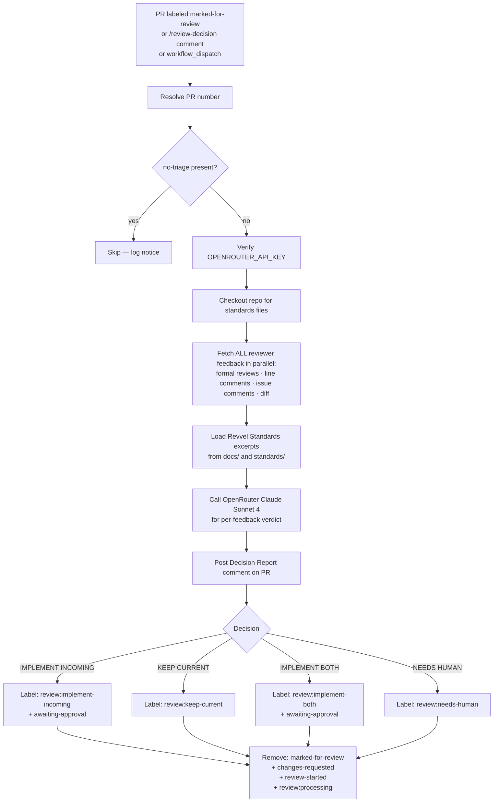

# PR Marked-For-Review — Automated Decision Orchestration

## Overview

The `pr-marked-for-review.yml` workflow provides a **review decision agent** that fires whenever the `marked-for-review` label is applied to a pull request. The agent evaluates all reviewer feedback against Revvel Standards and renders an explicit, labelled verdict so downstream auto-processing can continue without human intervention.

This replaces a previously desired BITO capability (BITO's label-triggered review acceptance loop) with an OpenRouter-native implementation that actually works.

---

## How It Works

---

## Labels

### Trigger Label

| Label | Color | Meaning | Applied By |
|-------|-------|---------|------------|
| `marked-for-review` | `#7057ff` Purple | Trigger the review-orchestration agent | Human or automation |

### Decision Labels (output)

| Label | Meaning |
|-------|---------|
| `review:implement-incoming` | Agent accepted reviewer suggestions (incoming changes win) |
| `review:keep-current` | Agent deferred/rejected reviewer suggestions (current PR content kept) |
| `review:implement-both` | Agent merged the reviewer's idea with the existing PR content |
| `review:needs-human` | Too complex, contradictory, or ambiguous — escalated to human |

### Processing Label

| Label | Meaning |
|-------|---------|
| `review:processing` | Handler is currently running |

### Skip Label

| Label | Effect |
|-------|--------|
| `no-triage` | Workflow is skipped entirely |

---

## Verdicts

For each piece of reviewer feedback the agent renders one of four verdicts:

| Verdict | Meaning |
|---------|---------|
| **IMPLEMENT INCOMING** | Accept the reviewer's suggestion exactly as proposed. The reviewer is correct per Revvel Standards. |
| **KEEP CURRENT** | Keep the existing PR content. The reviewer's suggestion is incorrect, redundant, or non-standard. |
| **IMPLEMENT BOTH** | Cherry-pick the reviewer's idea while preserving the existing changes. The PR benefits from both. |
| **ESCALATE** | Standards are ambiguous, reviewers contradict each other, or the change is too risky to automate. |

The overall PR verdict is the most critical individual verdict (ESCALATE > IMPLEMENT INCOMING > IMPLEMENT BOTH > KEEP CURRENT).

---

## How to Trigger

### 1. Add the label (recommended)

Apply the `marked-for-review` label to any open PR. The workflow fires within seconds.

### 2. Slash command in a PR comment

Comment `/review-decision` on any PR. The workflow detects `issue_comment` events where the comment starts with `/review-decision`.

### 3. Manual dispatch

Go to **Actions → PR Marked-For-Review — Decision Orchestration → Run workflow** and enter the PR number.

---

## Label Reset Logic

After the decision is made, the workflow:

1. **Removes** `marked-for-review` (prevent re-trigger loop)
2. **Removes** `review:processing` (transient state)
3. **Removes** `changes-requested` and `review-started` (stale review-cycle labels)
4. **Adds** `awaiting-approval` if the decision is `implement-incoming` or `implement-both` (signals PR is ready for final approval)
5. **Applies** the decision label so downstream workflows (auto-merge, project boards, etc.) can react

---

## Required Secrets

| Secret | Purpose |
|--------|---------|
| `OPENROUTER_API_KEY` | Authenticates the OpenRouter API call |
| `ADMIN_GITHUB_TOKEN` (optional) | Falls back to `GITHUB_TOKEN` if not set |

---

## Interaction with Other Workflows

| Workflow | Relationship |
|----------|-------------|
| `pr-review-status.yml` | Sets `changes-requested` / `awaiting-approval` from human review events. The marked-for-review handler resets these after its decision. |
| `pr-review-request-handler.yml` | Triggers on `changes-requested`; analyzes feedback and posts recommendations. The marked-for-review handler is the *acceptance* step that follows. |
| `bito-ai.yml` | BITO posts AI reviews; marked-for-review agent evaluates those reviews along with all others. |
| `auto-merge.yml` | Downstream consumer of `awaiting-approval` label set by this workflow. |

---

## Troubleshooting

### Workflow not triggering

1. Confirm `marked-for-review` label exists in `.github/labels.yml` and is synced
2. Check `OPENROUTER_API_KEY` secret is set
3. Verify the PR does not have the `no-triage` label
4. Check **Actions** tab for run history

### Decision label not applied

1. Inspect the workflow run logs for the `Run review orchestration` step
2. Check the PR for the `<!-- pr-marked-for-review -->` comment — it will contain the error
3. If `review:needs-human` is applied, manually review the feedback and apply the correct decision label

### OPENROUTER_API_KEY missing

The workflow hard-fails and posts a `review:needs-human` label. Add the secret under **Settings → Secrets and variables → Actions**.

---

## Files

| File | Purpose |
|------|---------|
| `.github/workflows/pr-marked-for-review.yml` | The workflow |
| `scripts/pr-marked-review-handler.js` | The OpenRouter handler script |
| `.github/labels.yml` | Label definitions (trigger + decision labels) |
| `docs/PR_MARKED_FOR_REVIEW_AUTOMATION.md` | This documentation |
