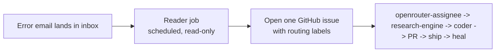

# Email Error Intake — turn error emails into auto-fixed issues

**Status:** Documented, not yet wired (no email access is configured).
**Goal:** route errors that land in your email into the same
route → research → fix → heal pipeline the rest of the system uses.

The automation only acts on **GitHub issues**. So the bridge is simple:

> error email → a GitHub issue (labeled for routing) → the existing pipeline
> takes over (see [`SYSTEM_MAP.md`](./SYSTEM_MAP.md)).



---

## What you need (one secret)

A **Gmail App Password** — not your normal password. Steps:

1. Turn on **2-Step Verification** on the Google account
   (`myaccount.google.com` → Security).
2. Go to **Security → App passwords**.
3. Create one named `revvel error intake` and copy the 16-character value.
4. In the repo: **Settings → Secrets and variables → Actions → New repository
   secret**:
   - `GMAIL_APP_PASSWORD` = the 16-char app password
   - `GMAIL_ADDRESS` = the inbox to read (e.g. `angelreporters@gmail.com`)

> Secret names allow only `A–Z`, `0–9`, `_` (no hyphens/dots/spaces).

---

## Approach A — scheduled reader (recommended for 24/7)

A GitHub Action on a cron reads unread "error" emails over IMAP (read-only),
opens one issue each, then marks them read. Skeleton:

```yaml
name: Email Error Intake
on:
  schedule:
    - cron: '*/30 * * * *'   # every 30 min
  workflow_dispatch:
permissions:
  issues: write
jobs:
  intake:
    runs-on: ubuntu-latest
    steps:
      - uses: actions/checkout@v4
      - uses: actions/setup-node@v4
        with:
          node-version: '22'
      - name: Read inbox and open issues
        env:
          GMAIL_ADDRESS: ${{ secrets.GMAIL_ADDRESS }}
          GMAIL_APP_PASSWORD: ${{ secrets.GMAIL_APP_PASSWORD }}
          GH_TOKEN: ${{ github.token }}
        run: node scripts/email-error-intake.js
```

The script (to be written when you enable this) would:

1. Connect to `imap.gmail.com` with the address + app password (read-only).
2. Select unread messages matching an **error filter** (see below).
3. For each, `gh issue create` with a title from the subject and a body
   containing the sender, date, and the email's `Message-ID` (for dedupe).
4. Apply routing labels so the pipeline picks it up:
   `work-request`, `agent-fallback`, `openrouter`, and `needs-triage`.
5. Mark the message read.

---

## Approach B — Gmail filter + forwarding (no secret)

In Gmail, create a **filter** (matching the error senders/subjects) that
**forwards** to an email-to-GitHub-issue endpoint. Simpler and needs no secret,
but depends on a forwarding service. Good if you'd rather not store a password.

---

## What counts as an "error" (so it doesn't act on everything)

Filter before opening issues — otherwise newsletters become work requests:

- **By sender:** monitoring/CI/service alert addresses only.
- **By subject keywords:** `error`, `failed`, `failure`, `alert`, `exception`,
  `5xx`, `down`, `timeout`.
- **Skip:** marketing, newsletters, receipts, social notifications.

---

## Safety rules

- **Read-only** on the inbox (IMAP read + mark-as-read). Never send or delete.
- **One issue per email**, de-duplicated by `Message-ID` in the issue body.
- Start with the `needs-triage` label so **oAudrey/you review before auto-coding**,
  until you trust it. Drop `needs-triage` (and add `wr:code`) once confident.
- Keep the cron modest (every 30–60 min) to limit cost.

---

## Once it's an issue

Nothing else to build — the existing pipeline handles it:
routed → researched → implemented (PR) → reviewed by the jury → shipped → healed.
See [`SYSTEM_MAP.md`](./SYSTEM_MAP.md).

**To turn this on:** add the two secrets above and ask for Approach A to be wired
(`scripts/email-error-intake.js` + the workflow).
