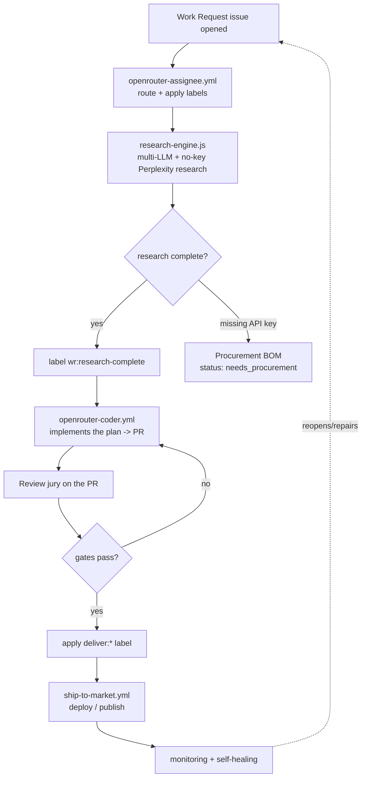

# Revvel-Standards — System Map

**Audience:** the owner (for code review + audit accountability) and any agent.
**Purpose:** the whole automation system on paper — what runs, in what order, what
each project is evaluated for, and how it heals itself.

> Plain-language version: [`how-it-works.html`](./how-it-works.html).

---

## The one-sentence version

A Work Request (a GitHub issue) is routed, deeply researched by multiple LLMs,
turned into a documented plan, implemented into a pull request, reviewed by a
gate of scanners, and shipped to a delivery channel chosen from what the project
needs — and the whole loop monitors and repairs itself.

---

## The three layers

| Layer | Job | Where it lives |
| --- | --- | --- |
| **Orchestrator** | Owns `state.json`, routes intake to engines, never calls runners directly | `engines/runner-orchestrator/orchestrate.js` (`npm run engine`) |
| **Engines** | Evaluate + produce artifacts (research, code, delivery) | `scripts/research-engine.js`, `.github/workflows/ship-to-market.yml` |
| **Runners** | Execute on external platforms (GitHub, Vercel, npm, stores) | invoked by engines; missing access → a Procurement BOM |

The contract for these layers is `engines/CONTRACT.md`.

---

## The pipeline (end to end)

### Stage by stage

1. **Intake & route** — `openrouter-assignee.yml` labels the issue and assigns
   the orchestrator. The orchestrator (`npm run engine`) refuses any request
   with no `revenue_target_monthly_usd` and writes a schema-valid `state.json`.
2. **Research** — `scripts/research-engine.js` fans out across multiple models
   (Claude / Gemini / GPT triad) and a no-key Perplexity lane, then synthesizes a
   research packet. On success it applies `wr:research-complete`.
3. **Implement** — `wr:research-complete` triggers `openrouter-coder.yml`, which
   writes the code and opens a PR.
4. **Review jury** — the PR is scanned (see "What gets evaluated" below).
5. **Ship** — a `deliver:*` label routes `ship-to-market.yml` to the right
   channel (PDF, app, CLI, API, MCP, docs, …).
6. **Heal** — watchdogs reopen/repair stuck work (see "Self-healing").

---

## What every project gets evaluated for

The Work Request **Output Type** (and/or delivery shape) decides what the project
needs and where it ships:

| If the project is… | Output Type | Ships as (`deliver:`) |
| --- | --- | --- |
| A sellable document | `sellable-pdf` | `pdf` |
| A web app / landing page | `production-app`, `desktop-tool` | `app` |
| A command-line tool | `cli-product` | `cli` |
| A machine-to-machine service | `api-product` | `api` |
| An MCP server | `mcp-product` | `mcp` |
| Documentation | `technical-documentation`, `project-management-doc` | `docs` |
| A script/automation | `internal-script-automation` | `cli` |

On top of that, every PR is evaluated for **quality (needs enhancement?)**:

| Check | Tool | Blocks merge? |
| --- | --- | --- |
| Tests pass | `node --test` (CircleCI) | yes |
| Coverage (80% lines/functions, 75% branches) | `c8` | aspirational (not yet required) |
| Security + secrets | Semgrep (ERROR severity, diff-aware) | yes, once marked required |
| Code analysis | CodeQL (JS + workflows) | surfaced as alerts |
| AI review verdict | Jules (`fail_on: blocking`) | yes, once its key works |
| Accessibility | axe / WCAG checker | advisory |
| SEO metadata | `scripts/schema-rich-results-checker.js` | advisory |

"Needs enhancement" = any of the above failing (missing tests, low coverage,
security findings, a11y/SEO gaps).

---

## State (the memory)

- **Schema:** `schemas/state.schema.json` — every state write is validated against it.
- **Per project:** `state.json` carries `intake_id`, `product_slug`,
  `revenue_target_monthly_usd`, `goal_phase`, `status`, and a list of `steps`.
- **Rule:** no step exists without a revenue target (CONTRACT Rule 4).

---

## Self-healing & monitoring

| Mechanism | What it does |
| --- | --- |
| `stuck-wr-detector.yml` | Finds Work Requests stuck too long, re-routes them |
| `agent-fallback.yml` | Picks up repair issues when the primary agent fails |
| `stuck-label-watchdog.yml` | Turns stuck PRs into agent repair issues |
| `automation-doctor.js` | Validates workflows + labels (`npm run automation:doctor`) |
| `wr-lint.yml` + `wr/scripts/wr-lint.mjs` | Catches scaffolding leak, raw `{TOKEN}` substitutions, bracket placeholders, and any `[x]` checklist item flipped on while forbidden placeholders remain |
| `fix-wr-gate.yml` + `wr/scripts/fix-wr-gate.mjs` | Blocks "documents the fix but doesn't apply it" PRs. Tracking-only escape requires both a tracking-* label AND an explicit `Tracks: #NNNN` reference in the PR body pointing at the follow-up that applies the actual fix |
| `no-root-junk.yml` | Blocks throwaway dev files at repo root (`plan.md`, `finish_clean.js`, `fix_boilerplate.js`, `update_wr.js`, `tmp_*`, `scratch*`, etc.) on every PR |
| Procurement BOM | When a credential/API is missing, writes `BOM.md` instead of failing silently |

---

## The agents (personas)

`scripts/openrouter-personas.js` defines named lanes, summonable from a PR/issue
comment with a **leading slash** (`/professor`, `/oaudrey`, `/mindmappr`,
`/openrouter`, `/coder`, or `/persona <name>`). Do **not** use `@professor` —
GitHub reads `@name` as a mention of the real user account with that username
and emails them. Each persona also has a role-name alias so it's easy to
remember by what it does:

| Canonical | Role alias | What it does |
| --- | --- | --- |
| **oAudrey** (`/oaudrey`) | Triager (`/triager`) | First line of sight — sorts the inbox and decides next step |
| **The Professor** (`/professor`) | Citer (`/citer`) | Cited research via no-key Perplexity Sonar lane (free) |
| **MindMappr** (`/mindmappr`) | Spotter (`/spotter`) | Turns fuzzy ideas into structured mind maps / outlines |
| **OpenRouter** (`/openrouter`) | Dispatcher (`/dispatcher`) | Model routing with fallback chains, picks cheapest capable |
| **Coder** (`/coder`) | Fixer (`/fixer`) | Applies the actual code fix — consumes Devin / Octopus / Copilot diagnoses into a minimal patch |

**Coder lane wiring** (`.github/workflows/openrouter-coder.yml`): primary
attempt routes through whichever Roo successor you wire — **Cline** (the
original Roo was forked from this), **ZooCode** (community fork), or
**Roomote** (the founders' Slack-native commercial product). Roo Code
itself was archived May 15 2026, so there is no default CLI to npx;
activation is opt-in via `ROO_RUN_COMMAND` (a repo variable holding a
one-liner that produces `/tmp/openrouter-coder-result.json`). OpenRouter
is the always-available backup — runs unchanged if `ROO_API_KEY` +
`ROO_RUN_COMMAND` aren't both set, or if the Roo step soft-fails or
returns zero files.

---

## Where to look (for code review / audit)

- Contract & state: `engines/CONTRACT.md`, `schemas/state.schema.json`
- Orchestrator: `engines/runner-orchestrator/orchestrate.js`
- Research: `scripts/research-engine.js`
- Implementation: `.github/workflows/openrouter-coder.yml`
- Delivery: `.github/workflows/ship-to-market.yml`
- Review gates: `.github/workflows/semgrep.yml`, `codeql.yml`, `jules-pr-reviewer.yml`
- Required-check setup: `docs/BRANCH_PROTECTION_REQUIRED_CHECKS.md`
- Email errors → issues (planned): `docs/process/EMAIL_ERROR_INTAKE.md`
- Full audit & roadmap: `docs/REVVEL_STANDARDS_AUDIT.md`
