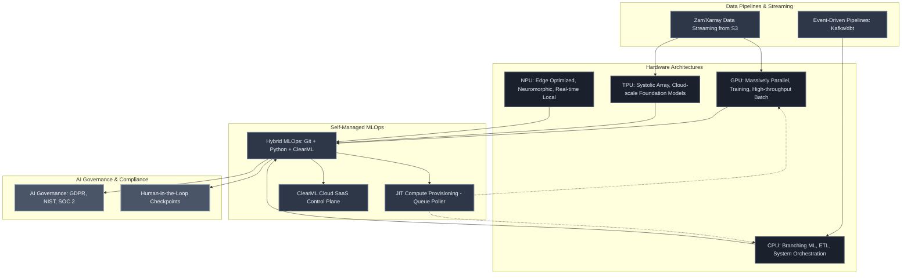

# AI Architecture & Hardware Selection Framework

```mermaid
graph TD
    %% Define styles for nodes
    classDef hardware fill:#1a202c,stroke:#4a5568,stroke-width:2px,color:#e2e8f0;
    classDef software fill:#2d3748,stroke:#718096,stroke-width:2px,color:#edf2f7;
    classDef compliance fill:#4a5568,stroke:#a0aec0,stroke-width:2px,color:#f7fafc;

    %% Data layer
    subgraph Data Pipelines & Streaming
        Zarr[Zarr/Xarray Data Streaming from S3]:::software
        Kafka[Event-Driven Pipelines: Kafka/dbt]:::software
    end

    %% Hardware layer
    subgraph Hardware Architectures
        CPU[CPU: Branching ML, ETL, System Orchestration]:::hardware
        GPU[GPU: Massively Parallel, Training, High-throughput Batch]:::hardware
        TPU[TPU: Systolic Array, Cloud-scale Foundation Models]:::hardware
        NPU[NPU: Edge Optimized, Neuromorphic, Real-time Local]:::hardware
    end

    %% MLOps layer
    subgraph Self-Managed MLOps
        MLOps[Hybrid MLOps: Git + Python + ClearML]:::software
        JIT[JIT Compute Provisioning - Queue Poller]:::software
        SaaS[ClearML Cloud SaaS Control Plane]:::software
    end

    %% Governance layer
    subgraph AI Governance & Compliance
        Gov[AI Governance: GDPR, NIST, SOC 2]:::compliance
        HITL[Human-in-the-Loop Checkpoints]:::compliance
    end

    %% Connections
    Zarr --> GPU
    Zarr --> TPU
    Kafka --> CPU

    CPU --> MLOps
    GPU --> MLOps
    TPU --> MLOps
    NPU --> MLOps

    MLOps --> JIT
    MLOps --> SaaS

    JIT -.-> CPU
    JIT -.-> GPU

    MLOps --> Gov
    MLOps --> HITL
```
