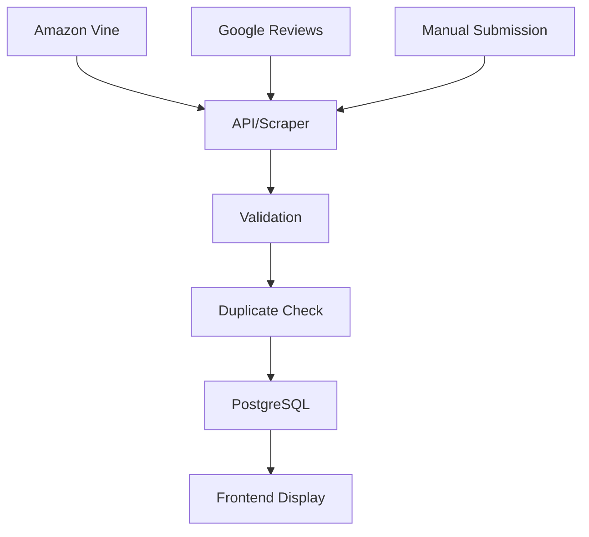

# Reese Reviews - Professional Amazon Vine Product Reviews

## Live Deployment

▶️ **[Open the live app & test it](https://midnghtsapphire.github.io/revvel-standards/docs/reesereviews/)**

## Overview

Reese Reviews is a professional product review platform focused on Amazon Vine reviews, featuring:

- 80,000+ total views
- 500+ products reviewed
- 4.9★ average rating
- Photo and video reviews
- Unbiased, thorough testing

## Technology Stack

- **Frontend:** Pure HTML/CSS/JS (glassmorphism dark UI per Revvel Standards)
- **Backend:** FastAPI (planned)
- **Database:** PostgreSQL
- **Review Collection:** Judge.me + Custom aggregation service
- **Social Media:** n8n workflows + Trigify CLI
- **Deployment:** Kong Gateway routing to reesereviews.com

## Project Structure

```text
reesereviews/
├── index.html              # Main landing page
├── assets/                 # Images, logos, favicons
│   ├── logo.png
│   ├── favicon-16x16.png
│   ├── favicon-32x32.png
│   ├── apple-touch-icon.png
│   └── og-image.jpg
├── src/                    # Source code (planned)
│   ├── api/               # FastAPI backend
│   ├── components/        # Reusable components
│   └── utils/             # Helper functions
├── docs/                   # Documentation
│   ├── AUTOMATION_PLAN.md
│   ├── API_DOCS.md
│   └── DEPLOYMENT.md
└── README.md              # This file
```

## Features

### Current (v1.0)
- ✅ Responsive landing page with glassmorphism UI
- ✅ Review display with filtering and search
- ✅ Trust badges and social proof
- ✅ SEO optimization with Schema.org markup
- ✅ Newsletter signup
- ✅ Accessibility modes (5 modes per Revvel Standards)

### Planned (v1.1+)
- 🔄 Amazon Vine review import automation
- 🔄 Judge.me integration for review collection
- 🔄 Multi-source review aggregation
- 🔄 Social media auto-posting
- 🔄 Review submission portal
- 🔄 Advanced filtering and search
- 🔄 User accounts and profiles
- 🔄 Review voting and helpfulness ratings
- 🔄 Odoo CRM integration
- 🔄 Analytics dashboard

## Revvel Standards Compliance

This project follows all Revvel Standards:

- **Design:** Glassmorphism dark UI with warm tones
- **Accessibility:** 5 toggleable modes (WCAG AAA, ECO, NEURO, DYSLEXIC, NO BLUE LIGHT)
- **SEO:** Full Schema.org markup, meta tags, Open Graph
- **Brand:** Follows Revvel Emblem Standard derivation
- **Testing:** Planned - Vitest unit tests, Playwright E2E
- **Documentation:** Comprehensive docs in `/docs`

## Setup & Development

### Prerequisites
- Node.js 18+
- Python 3.11+
- PostgreSQL 15+
- Nginx or Kong Gateway

### Local Development

1. Clone the repository:
```bash
git clone https://github.com/midnghtsapphire/revvel-standards.git
cd revvel-standards/reesereviews
```

1. Set up environment variables:
```bash
cp .env.example .env
# Edit .env with your API keys
```

1. Install dependencies:
```bash
npm install  # For frontend build tools
pip install -r requirements.txt  # For backend API
```

1. Run development server:
```bash
# Simple HTTP server for frontend
python -m http.server 8080

# Or use live-server for hot reload
npx live-server --port=8080
```

1. Access at `http://localhost:8080`

### Production Deployment

See [`docs/DEPLOYMENT.md`](docs/DEPLOYMENT.md) for full deployment instructions.

Quick deploy via Kong Gateway:
```bash
# Update Kong configuration
cd /home/runner/work/revvel-standards/revvel-standards/install/kong
./bootstrap.sh

# Verify routing
curl -I https://reesereviews.com
```

## API Integration

### Automated API Key Setup

Run the automation script to set up test API keys:

```bash
./scripts/setup-api-keys.sh
```

This will:
1. Create test accounts for Judge.me, Amazon PA API, Google Reviews
2. Retrieve API keys automatically
3. Populate `.env` file
4. Verify connectivity

### Manual API Setup

If automation fails, follow these steps:

#### Judge.me
1. Sign up at <https://judge.me>
2. Navigate to Settings → API
3. Generate API token
4. Add to `.env`: `JUDGEME_API_KEY=your_key_here`

#### Amazon Product Advertising API
1. Apply at <https://affiliate-program.amazon.com/signup>
2. Request API access
3. Generate keys in Associates Central
4. Add to `.env`: `AMAZON_API_KEY=your_key_here`

#### Google My Business API
1. Create project at <https://console.cloud.google.com>
2. Enable Google My Business API
3. Create OAuth2 credentials
4. Add to `.env`: `GOOGLE_API_KEY=your_key_here`

## Review Collection Workflow

### Automated Collection



### Manual Review Process

1. Receive product from Amazon Vine
2. Test product thoroughly (1-2 weeks)
3. Create review with photos/videos
4. Submit to platform
5. Auto-sync to reesereviews.com

## Social Media Integration

Automated posting to:
- YouTube (video reviews)
- Twitter/X (review highlights)
- Instagram (product photos)
- TikTok (short review clips)

Using:
- **n8n**: Workflow automation
- **Trigify CLI**: Social listening and posting
- **Buffer alternative**: Self-hosted scheduler

## Analytics

Track key metrics:
- Total reviews
- Average rating
- Page views per review
- Conversion rate (clicks to Amazon)
- Newsletter signup rate
- Social media engagement

Dashboard planned for v1.2.

## Contributing

This is a private project within the Revvel ecosystem. For questions or suggestions:

- Email: <angelreporters@gmail.com>
- Issues: Create in revvel-standards repo

## License

All Rights Reserved. Copyright 2010-2026 Freedom Angel Corp / Audrey Evans.

Part of the MIDNGHTSAPPHIRE Revvel ecosystem.

## Changelog

See [CHANGELOG.md](../CHANGELOG.md) for version history.

## Related Projects

- **steel-white**: Backend repository for review management
- **revvel-standards**: Master standards and templates
- **oaudrey**: Portfolio hub linking to all projects

## Support

For support or questions about Reese Reviews:

- **Email:** <support@reesereviews.com>
- **Website:** <https://reesereviews.com>
- **Parent Org:** MIDNGHTSAPPHIRE / Revvel

---

**Built with ❤️ following Revvel Standards | Amazon Vine Member | Verified Reviewer**
